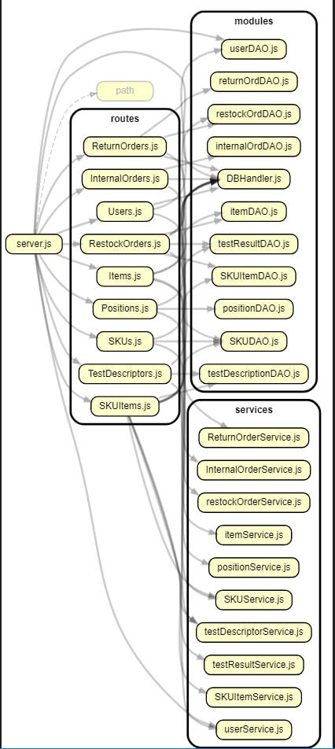

# Integration and API Test Report

Date: 25 April 2022
Authors: Abdallah El Mouaatamid, Marziyeh Karani, Omar Ormachea, Francesco Di Gangi
Version:

# Contents

- [Dependency graph](#dependency graph)

- [Integration and API Test Report](#integration-and-api-test-report)
- [Contents](#contents)
- [Dependency graph](#dependency-graph)
- [Integration approach](#integration-approach)
- [Integration Tests](#integration-tests)
  - [Step 1](#step-1)
  - [Step 2](#step-2)
  - [Step 3](#step-3)
- [API testing - Scenarios](#api-testing---scenarios)
  - [Scenario UCx.y](#scenario-ucxy)
  - [Scenario UC5.1-2](#scenario-uc51-2)
  - [Scenario UC11-3](#scenario-uc11-3)
  - [Scenario 9-1](#scenario-9-1)
  - [Scenario 6-2](#scenario-6-2)
  - [Scenario UC2-6](#scenario-uc2-6)
  - [Scenario UC1-4](#scenario-uc1-4)
  - [Scenario UC1-2](#scenario-uc1-2)
  - [Scenario UC13-1](#scenario-uc13-1)
  - [Scenario UC13-2](#scenario-uc13-2)
  - [Scenario UC13-3](#scenario-uc13-3)
  - [Scenario UC12-1](#scenario-uc12-1)
  - [Scenario UC12-2](#scenario-uc12-2)
  - [Scenario UC12-3](#scenario-uc12-3)
  - [Scenario UC5-2-3](#scenario-uc5-2-3)
  - [Scenario UC5-2-4](#scenario-uc5-2-4)
- [Coverage of Scenarios and FR](#coverage-of-scenarios-and-fr)
- [Coverage of Non Functional Requirements](#coverage-of-non-functional-requirements)
    - 

- [Tests](#tests)

- [Scenarios](#scenarios)

- [Coverage of scenarios and FR](#scenario-coverage)
- [Coverage of non-functional requirements](#nfr-coverage)

# Dependency graph 

     
# Integration approach

A bottom-up integration approach was adopted. After testing the DAO classes, the corresponding Service classes were tested (which call the DAO classes). As last step, API's were called with Mocha agent.

    step 1: class (DAO)
    step 2: class (DAO + Service)
    step 3: class (DAO + Service) + API testing
    

    

#  Integration Tests

## Step 1
| Classes        | mock up used     | Jest test cases        |
| -------------- | ---------------- | ---------------------- |
| restockOrdDAO  | EzWHDBDAOtest.db | restockOrdDAO.test.js  |
| userDAO        | none             | userDao.test.js        |
| positionDAO    | none             | position.test.js       |
| itemDAO        | none             | item.test.js           |
| InternalOrdDAO | none             | internalOrdDAO.test.js |
| ReturnOrdDAO   | none             | returnOrdDAO.test.js   |
| SKUDAO         | none             | SKU.test.js  |
| SKUItemDAO   | none               | SKUItem.test.js   |
| testDescriptionDAO   | none       | testDescriptor.test.j   |
| testResultDAO   | none            | testResult.test.js   |

## Step 2
| Classes              | mock up used | Jest test cases                  |
| -------------------- | ------------ | -------------------------------- |
| restockOrderService  | none         | restockOrdService_dbreal.test.js |
| userService          | none         | user_service_dbreal.test.js      |
| positionService      | none         | position_service_dbreal.test.js  |
| itemService          | none         | item_service_dbreal.test.js      |
| InternalOrderService | none         | internalOrdsvc.test.js           |
| ReturnOrderService   | none         | returnORDsvc.test.js             |
| SKUService  | none                  | SKUService_dbreal.test.js             |
| SKUItemService   | none             | SKUItemService_dbreal.test.js            |
| testDescriptorService   | none      | testDescriptorService_dbreal.test.js             |
| testResultService   | none          | testResultService_dbreal.test.js             |

## Step 3 

   
| Classes        | mock up used | Mocha test cases             |
| -------------- | ------------ | ---------------------------- |
| RestockOrders  | none         | test/testRestockOrdRouter.js |
| Users          | none         | test/testUserRoute.js        |
| Positions      | none         | test/testPositionRouter.js   |
| Item           | none         | test/testItemRouter.js       |
| InternalOrders | none         | testInternalOrderRouter.js   |
| ReturnOrders   | none         | testReturnOrderRouter.js     |
| SKU   | none         | testSKURouter.js     |
| SKUItem   | none         | testSKUItemRouter.js     |
| TestResult   | none         | testTestResult.js     |

# API testing - Scenarios

     <If needed, define here additional scenarios for the application. Scenarios should be named
     referring the UC in the OfficialRequirements that they detail>

## Scenario UCx.y

| Scenario       |    name     |
| -------------- | :---------: |
| Precondition   |             |
| Post condition |             |
| Step#          | Description |
| 1              |     ...     |
| 2              |     ...     |

## Scenario UC5.1-2
| Scenario       |  Record restock order arrival with delivery date   |
| -------------- | :------------------------------------------------: |
| Precondition   |          Clerk C exists and is logged in           |
|                |                    SKU S exists                    |
|                |               SKU position is valid                |
|                |  Restock Order RO exists and is in DELIVERY state  |
| Post condition |             RO is in DELIVERED  state              |
|                |             Each sku item has an RFID              |
| Step#          |                    Description                     |
| 1              |               RO arrives to the shop               |
| 2              |     C records the delivery date on the system      |
| 3              | C records every item in the system with a new RFID |
| 4              |          System stores RFID of SKU Items           |
| 5              |   RO is updated in the system in DELIVERED state   |

## Scenario UC11-3
| Scenario       |                Find an item by its id                |
| -------------- | :--------------------------------------------------: |
| Precondition   | Item I exists and supplier S exists and is logged id |
| Post condition |               The application shows I                |
| Step#          |                     Description                      |
| 1              |     S inserts the ID of the item is looking for      |
| 2              |             S confirms the entered data              |

## Scenario 9-1 

| Scenario       |                        Internal Order IO accepted                         |
| -------------- | :-----------------------------------------------------------------------: |
| Precondition   |                    Customer C exists and is logged in                     |
|                |                     Manager M exists and is logged in                     |
|                |          SKUs exists and have enough units to complete the order          |
| Post condition |                 For each SKU ordered: S.availability -= N                 |
|                |                          IO in state = ACCEPTED                           |
|                |                       Availability of SKU decreases                       |
|                |                    Availability of Position increases                     |
| Step#          |                                Description                                |
| 1              |                       C starts a new Internal Order                       |
| 2              |               C adds every SKU she wants in every qty to IO               |
| 3              |                               C confirms IO                               |
| 4              |                   System issue IO with status = ISSUED                    |
| 5              | System decreases availability of every SKU ordered and increases position |
| 6              |                        M checks IO and accepts it                         |
| 7              |                    System update IO status in ACCEPTED                    |

## Scenario 6-2

| Scenario       |                                         Return order of any SKU items                                          |
| -------------- | :------------------------------------------------------------------------------------------------------------: |
| Precondition   |                                       Manager M exists and is logged in                                        |
|                |                                                  SKU S exists                                                  |
|                |                           Restock order RO exists and is in state = COMPLETEDRETURN                            |
|                |      Restock order RO has at least 1 units of S that passed quality tests and need to be returned anyway       |
| Post condition |                                    Return Order REO registered into system                                     |
|                |                                  RFID for every SKU item returned is deleted                                   |
|                |                                  Availability of sku and of position updated                                   |
| Step#          |                                                  Description                                                   |
| 1              |                                                M inserts RO.ID                                                 |
| 2              |                                              Return order starts                                               |
| 3              |                         System provide RFID of SKU items that not passed quality tests                         |
| 4              | System provide RFID of SKU items that passed quality tests but need to be returned (eg wrong order by manager) |
| 5              |                                            M adds all items to REO                                             |
| 6              |                                          M confirms the inserted data                                          |
| 7              |                                System set all SKU items in state not available                                 |
| 8              |                    System update availability of SKU (decrease) and of position (increase)                     |
| 9              |                             Supplier is notified by the system, REO is registered                              |

## Scenario UC2-6
| Scenario |  List all positions |
| ------------- |:-------------:| 
|  Precondition     | Manager M exists and is logged in  |
|  Post condition     | The application shows all the positions or an empty list if there are no positions |
| Step#        | Description  |
|  1     |  M clicks on "Show all positions" |  
|  2     |  M confirms that he wants to see all the positions |

## Scenario UC1-4
| Scenario |  Modify SKU  |
| ------------- |:-------------:| 
|  Precondition     | Manager M exists and is logged in  |
|                   | SKU S exists |
|  Post condition     | SKU S updated |
| Step#        | Description  |
|  1     |  M searches S via ID |  
|  2     | M selects S's record |
|  3     |  M selects new value for S's weight |
|  4     |  M selects new value for S's volume |
|  4     |  M selects new value for S's description |
|  4     |  M selects new value for S's notes |
|  4     |  M selects new value for S's price |
|  4     |  M selects new value for S's availableQuantity |
|  5     | M confirms the modifications |

## Scenario UC1-2
| Scenario |  Modify SKU location |
| ------------- |:-------------:| 
|  Precondition     | Manager M exists and is logged in  |
|                   | SKU S exists |
|                   | Position P is not assigned to any SKU |
|  Post condition     | S.position = P |
| Step#        | Description  |
|  1     |  M searches S via ID |  
|  2     |  M selects S's record |
|  3     |  System provide free positions capable to store the SKU quantity |
|  4     |  M selects a new SKU position |
|  5     |  M confirms the modifications |

## Scenario UC13-1
| Scenario |  Create SKUItem SI |
| ------------- |:-------------:| 
|  Precondition     | Manager M exists and is logged in  |
|                   | SKU S exists |
|                   | RFID is not assigned to any SKUItem |
|  Post condition     | SI  into the system and with an assigned RFID and SKUId |
| Step#        | Description  |
|  1     |  M searches S |  
|  2     |  M selects S  |
|  3     |  M inserts new RFID |
|  4     |  M inserts new stockDate |
|  5     |  M confirms the entered data |

## Scenario UC13-2
| Scenario |  Update SKUItem SI |
| ------------- |:-------------:| 
|  Precondition     | Manager M exists and is logged in  |
|                   | SKUItem SI exists |
|                   | newRFID is not assigned to any SKUItem |
|  Post condition     | SKUItem SI updated |
| Step#        | Description  |
|  1     |  M searches SI via RFID |  
|  2     |  M selects SI |
|  3     |  M inserts new RFID |
|  4     |  M modify available |
|  5     |  M inserts new stockDate |
|  6     |  M confirms the entered data |

## Scenario UC13-3
| Scenario |  list all SKUItems of a SKU|
| ------------- |:-------------:| 
|  Precondition     | Manager M exists and is logged in  |
|                   | SKU S exists |
|  Post condition     | skuItems of SKU S listed|
| Step#        | Description  |
|  1     |  M searches S |  
|  2     |  M selects S  |
|  3     |  M clicks search button |

## Scenario UC12-1
| Scenario |  Create test description |
| ------------- |:-------------:| 
|  Precondition     | Manager M exists and is logged in  |
|                   | SKU S exists |
|  Post condition     | Test description is created |
| Step#        | Description  |
|  1     |  M defines name for T |  
|  2     |  M selects S for T |
|  3     |  M defines procedure description for T |
|  4     |  M confirms the inserted data |

## Scenario UC12-2
| Scenario |  Update test description |
| ------------- |:-------------:| 
|  Precondition     | Manager M exists and is logged in  |
|                   | Test description T exists |
|  Post condition     | Test description updated |
| Step#        | Description  |
|  1     |  M selects test description T |  
|  2     |  M updates procedure description |
|  3     |  M confirms the inserted data |

## Scenario UC12-3
| Scenario |  Delete test description |
| ------------- |:-------------:| 
|  Precondition     | Manager M exists and is logged in  |
|                   | Test description T exists |
|  Post condition     | Test description deleted |
| Step#        | Description  |
|  1     |  M selects test description T |  
|  2     |  M confirms the cancellation of T |

## Scenario UC5-2-3
| Scenario |  Record negative and positive test results of all SKU items of a RestockOrder |
| ------------- |:-------------:| 
|  Precondition     | Quality Employee Q exists and is logged in  |
|                   | SKU S exists |
|                   | SKU position is valid |
|                   | Every SKU Item has an RFID attached |
|                   | Restock Order RO exists and is in DELIVERED state |
|  Post condition     | RO is in TESTED state |
|                   | Every SKU Item has a list of test results attached |
| Step#        | Description  |
|  1     |  Q performs quality test on every SKU item |  
|  2     | Q records negative and positive tests result in the system for SKU items |
|  3     |  RO is updated in the system in TESTED state |  

## Scenario UC5-2-4
| Scenario |  find test result TR |
| ------------- |:-------------:| 
|  Precondition     | Quality Employee Q exists and is logged in  |
|                   | SKUItem SI exists |
|                   | Test Result TR exists |
|  Post condition     | Test Result TR returned|
| Step#        | Description  |
|  1     |  Q searches TR via RFID and ID  |  
|  3     | Test Result TR is shown | 

# Coverage of Scenarios and FR

     <Report in the following table the coverage of  scenarios (from official requirements and from above) vs FR. 
     Report also for each of the scenarios the (one or more) API Mocha tests that cover it. >  Mocha test cases should be here code/server/test

| Scenario ID | Functional Requirements covered | Mocha  Test(s) | 
| ----------- | ------------------------------- | ----------- | 
| 1-2        | FR2.1                                        | testSKURouter.setPosition() |
| 1-4        | FR2.1                                       | testSKURouter.updateSKU() |
|  2-4         |FR3.1.1                           |testPositionRouter.testModifyAPositionByitsOld()|
|2-5|FR3.1.2|testPositionRouter.testDeletePosition()
|2-6|FR3.1.3, FR3|testPositionRouter.testGetAllPositions()|        
| 3-1         |FR5.1, FR5.2, FR5.3, FR5.4, FR5.5, FR5.6, FR5  |testRestockOrdsRouter.testGetPostRestockOrder()      |  
| 3-2         |FR5.1, FR5.2, FR5.3, FR5.4, FR5.5, FR5.6, FR5  |testRestockOrdsRouter.testGetPostRestockOrder()           |             
|  4-1         |FR1.1, FR1                            |testUserRoute.testAddNewUser()        |             
| 4-2          |FR1.1, FR1                              |testUserRoute.testModifyRights()             |  
| 4-3          |FR1.2, FR1                                  |testIserRoute.testDeleteUser()             |                    
| 5-1-1         |FR5.8, FR5.8.1, FR5.8.3, FR5  |testRestockOrdsRouter.testAddSKUItemsByID()          |
| 5-1-2         |FR5.8, FR5  |testRestockOrdsRouter.testAddTransportNote()          |  
| 5-2-3         | FR5.8.2                                    | testTestResult.addTestResult()|
| 5-2-4         |                                   | testTestResult.findTestResult()|
| 6-1         |FR5.10, FR5  |testRestockOrdsRouter.testGetReturnItems()        |  
| 6-2         | FR5.9, FR5.10                                 | testReturnOrderRouter.testAddReturnOrder         |
| 9-1         | FR6.1, FR6.2, FR6.3, FR6.5,FR6.6,FR6.7,       | testInternalOrderRouter.testAddInteranlOrder()   |
| 11-1         |FR7                                |testItemRouter.testCreateNewItem()             |             
| 11-3         |FR7                                |testItemRouter.testFindItem()             |
| 13-1         | FR2.4 , FR5.8.1 ,5.8.3                                      | testSKUItemRouter.addSKUItem() |
| ...          |                                 |             |             

# Coverage of Non Functional Requirements

<Report in the following table the coverage of the Non Functional Requirements of the application - only those that can be tested with automated testing frameworks.>

### 

| Non Functional Requirement | Test name                                       |
| -------------------------- | ----------------------------------------------- |
| NFR2                       | All tests                                       |
| NFR4                       | testPositionRouter.testModifyAPositionByitsOldID()                                        |
| NFR6                       | testSKUItemRouter.addSKUItem()                                      |
| NFR9                       | testRestockOrdsRouter.testGetPostRestockOrder() |
|                            | testRestockOrdsRouter.testAddTransportNote()    |

