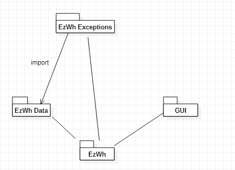
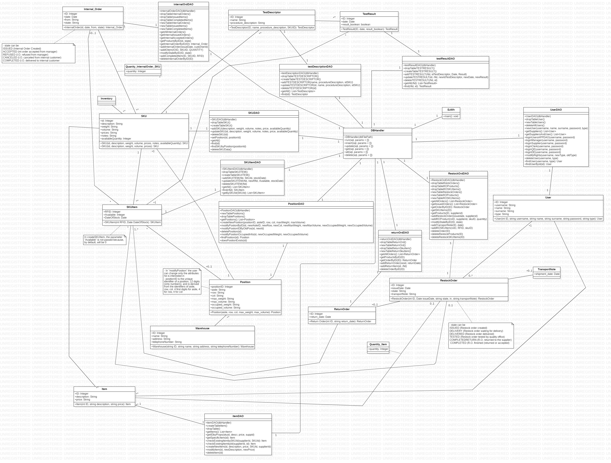
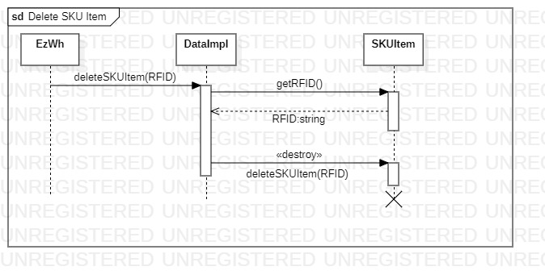
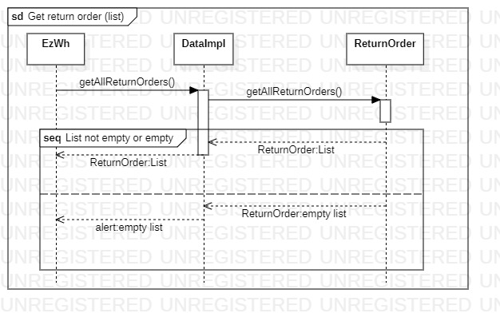
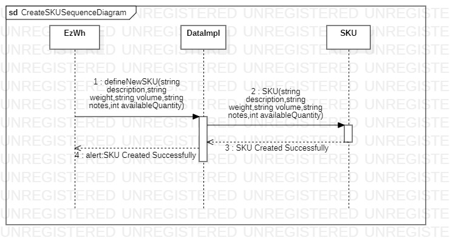
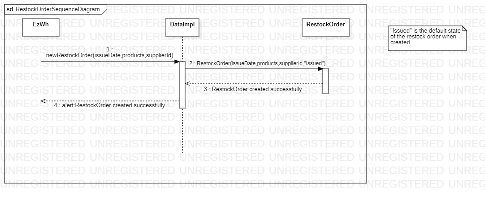
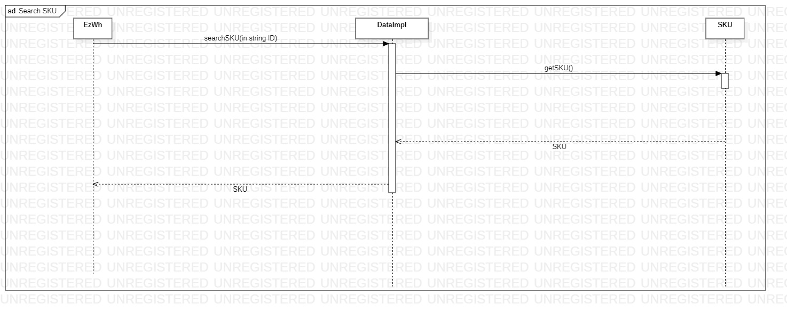
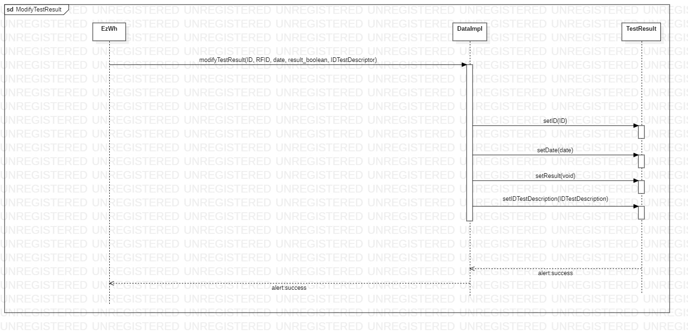

# Design Document

Authors: Abdallah El Mouaatamid, Marziyeh Karani, Omar Ormachea, Francesco Di Gangi 
 
Date: 27 April 2022

Version: 1.0 

# Contents

- [Design Document](#design-document)
- [Contents](#contents)
- [Instructions](#instructions)
- [High level design](#high-level-design)
- [Low level design](#low-level-design)
- [Verification traceability matrix](#verification-traceability-matrix)
- [Verification sequence diagrams](#verification-sequence-diagrams)
  - [Remove SKU Item from warehouse](#remove-sku-item-from-warehouse)
  - [Get return order list](#get-return-order-list)
  - [Define a new SKU, or modify an existing SKU](#define-a-new-sku-or-modify-an-existing-sku)
  - [Start a restock order](#start-a-restock-order)
  - [Search a SKU](#search-a-sku)
  - [Store result of a quality test on a SKU Item](#store-result-of-a-quality-test-on-a-sku-item)

# Instructions

The design must satisfy the Official Requirements document 

# High level design 

Layered architeture whit MVC pattern.

EzWh is a layered application. Our application is composed of the following packages:
- data, for managing and processing data
- gui, implementing the Graphical User Interface
- exceptions, for handling exceptions triggered by action of the user

We use a MVC pattern because the user of EzWh application can modify data and, consequently, views must change. EzWh additionally complies with the 3-tier pattern, since it manages data saved on the database (data tier) via application functions (application tier) and a GUI (presentation tier)
 
# Low level design

 

# Verification traceability matrix
| /   | DataImpl | SKU | SKUItem | Position | TestDescriptor | TestResult | User | RestockOrder | ReturnOrder | InternalOrder | Item | Warehouse | TransportNote | Inventory |
|-----|----------|-----|---------|----------|----------------|------------|------|--------------|-------------|---------------|------|-----------|---------------|-----------|
| FR1 | X        |     |         |          |                |            | X    |              |             |               |      |           |               |           |
| FR2 | X        | X   |         |          |                |            |      |              |             |               |      |           |               |           |
| FR3 | X        |     |         | X        | X              |            |      |              |             |               |      |           |               |           |
| FR4 | X        |     |         |          |                |            |      |              |             |               |      |           |               |           |
| FR5 | X        |     | X       |          |                | X          |      | X            | X           |               | X    |           |               |           |
| FR6 | X        | X   | X       |          |                |            |      |              |             | X             |      |           |               |           |
| FR7 | X        |     |         |          |                |            |      |              |             |               | X    |           |               |           | 

# Verification sequence diagrams 
## Remove SKU Item from warehouse

## Get return order list

## Define a new SKU, or modify an existing SKU

## Start a restock order

## Search a SKU

## Store result of a quality test on a SKU Item

