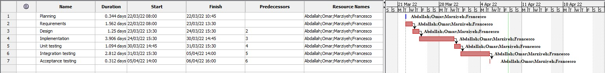

# Project Estimation  
Date: 13/04/2022

Version: 1.0

Authors: Abdallah El Mouaatamid, Marziyeh Karani, Omar Ormachea, Francesco Di Gangi

# Estimation approach
We have considered our requirements document for EzWarehouse project. The following documents show the appraoch
- by size
- by product decomposition
- by activity decomposition with a GANTT chart

# Estimate by size
### 
|             | Estimate                        |             
| ----------- | ------------------------------- |  
| NC =  Estimated number of classes to be developed   |        18                     |             
|  A = Estimated average size per class, in LOC       |   250                         | 
| S = Estimated size of project, in LOC (= NC * A) | 4500|
| E = Estimated effort, in person hours (here use productivity 10 LOC per person hour)  |                 450                     |   
| C = Estimated cost, in euro (here use 1 person hour cost = 30 euro) |€13500 | 
| Estimated calendar time, in calendar weeks (Assume team of 4 people, 8 hours per day, 5 days per week ) |       5 weeks (28 days)             |               

# Estimate by product decomposition
### 
|         component name    | Estimated effort (person hours)   |             
| ----------- | ------------------------------- | 
|requirement document    | 35|
| GUI prototype |9|
|design document |24|
|code |123|
| unit tests |45|
| api tests |23|
| management documents  |28|

# Estimate by activity decomposition
### 
|         Activity name    | Estimated effort (person hours)   |             
| ----------- | ------------------------------- | 
| Planning|11|
| Requirements |50 |
|Design|40|
|Implementation|125 |
|Unit testing|35 |
|Integration testing| 90 |
|Acceptance testing|10|
###

# Summary

Report here the results of the three estimation approaches. The  estimates may differ. Discuss here the possible reasons for the difference

|             | Estimated effort                        |   Estimated duration |          
| ----------- | ------------------------------- | ---------------|
| estimate by size |450| 28 days
| estimate by product decomposition |287| 9 days|
| estimate by activity decomposition |361| 12 days

We used two different approaches:
- **estimate by size**: we estimated the number of class and the LOCs that each class, in the average, may contains. 
- **estimate by product decomposition**: we estimated using a Delphi approach.
- **estimate by activity decomposition:** we estimated using a set of projects (by analogy) with similar activities. 

The difference between the efforts may be due to the use of different approaches. Since it is an estimation, times may be slightly different from the final time sheet. 
We also used the time sheet to help us estimate the amount of person/hour

