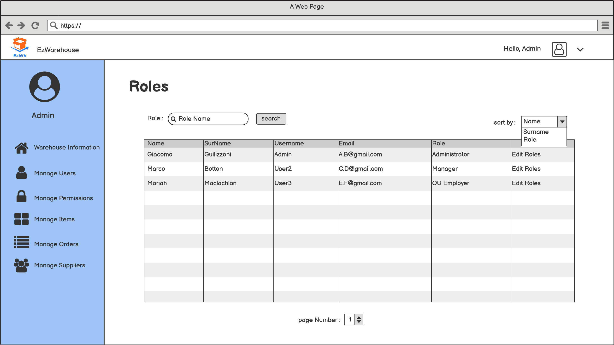
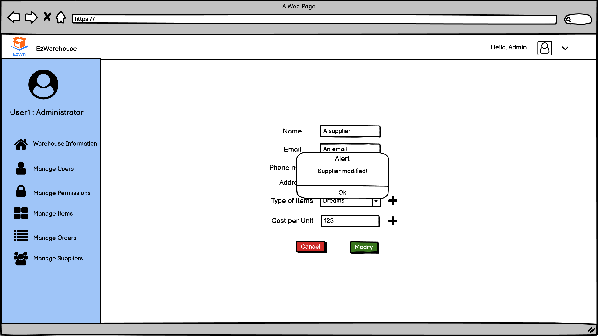

# Graphical User Interface Prototype  

Authors: Abdallah El Mouaatamid, Marziyeh Karani, Omar Ormachea, Francesco Di Gangi

Date: 13 April 2022

Version: 1.0

# Log in

# Administrator/Manager homepage

# Manage users

## Create account

## Modify user

## Disable account

# Manage Permission

### Manage item

## Search item

## Insert item

## Modify item

## Delete item

# Manage order

## Add order

## Modify order

## Remove order

## Update order status

# Manage warehouse

## Insert warehouse information

## Modify warehouse information

## Show warehouse location

# Manage suppliers

## Add supplier

## Modify supplier

## Search suppliers

# Quality check

## Send test results

# Ask for item

