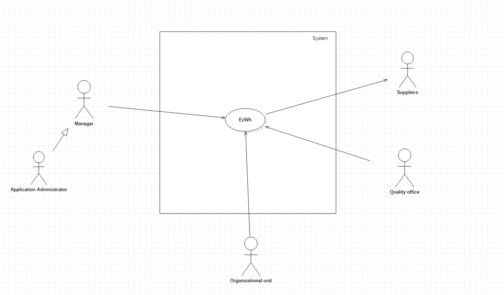
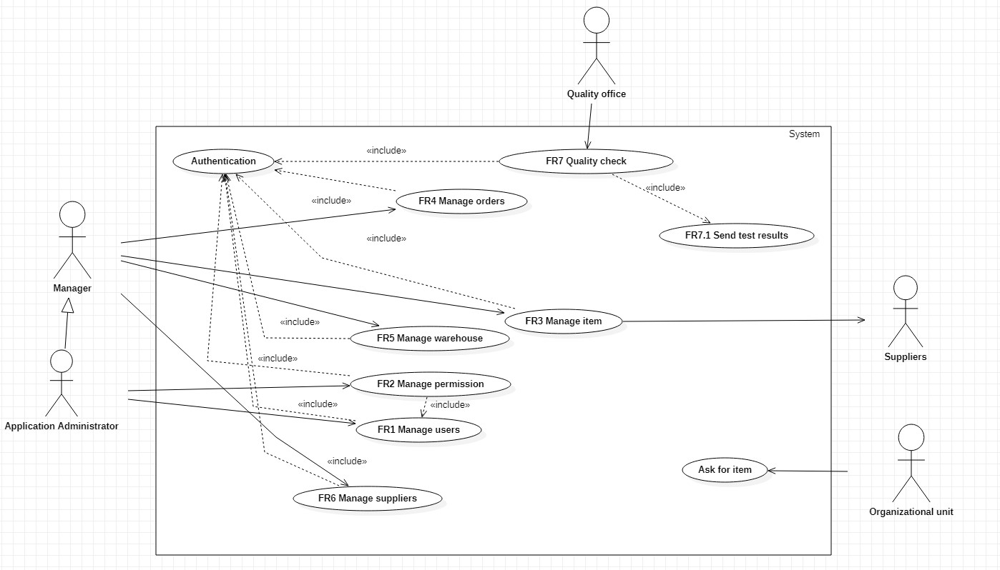
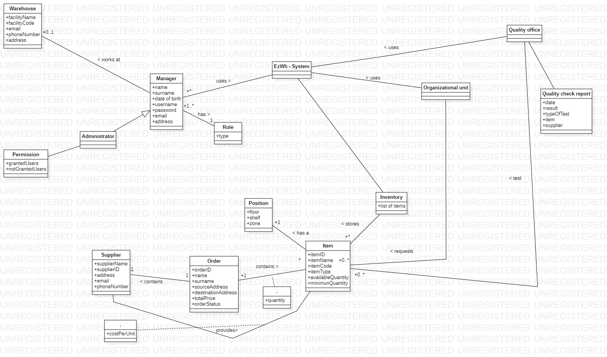
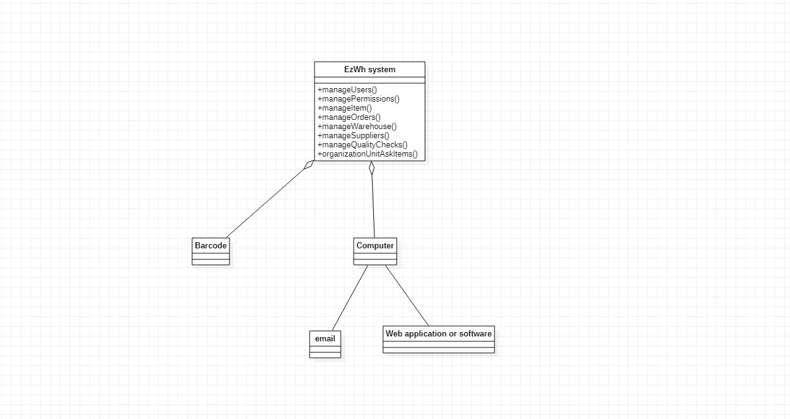
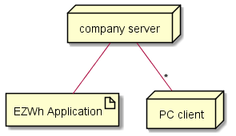

 # Requirements Document 

Date: 22 march 2022

Version: 1.0

Authors: Abdallah El Mouaatamid, Marziyeh Karani, Omar Ormachea, Francesco Di Gangi

 
| Version number | Change |
| ----------------- |:-----------|
| 1.0| | 

# Contents

- [Informal description](#informal-description)
- [Stakeholders](#stakeholders)
- [Context Diagram and interfaces](#context-diagram-and-interfaces)
	+ [Context Diagram](#context-diagram)
	+ [Interfaces](#interfaces) 
	
- [Requirements Document](#requirements-document)
- [Contents](#contents)
- [Informal description](#informal-description)
- [Stakeholders](#stakeholders)
- [Context Diagram and interfaces](#context-diagram-and-interfaces)
	- [Context Diagram](#context-diagram)
	- [Interfaces](#interfaces)
- [Stories and personas](#stories-and-personas)
- [Functional and non functional requirements](#functional-and-non-functional-requirements)
	- [Functional Requirements](#functional-requirements)
	- [Non Functional Requirements](#non-functional-requirements)
	- [Access right, actor vs function](#access-right-actor-vs-function)
- [Use case diagram and use cases](#use-case-diagram-and-use-cases)
	- [Use case diagram](#use-case-diagram)
		- [**Use case 1, UC1 - Manage users**](#use-case-1-uc1---manage-users)
				- [Scenario 1.1](#scenario-11)
				- [Scenario 1.2](#scenario-12)
				- [Scenario 1.3](#scenario-13)
		- [**Use case 2, UC2 - Manage permissions**](#use-case-2-uc2---manage-permissions)
				- [Scenario 2.1](#scenario-21)
				- [Scenario 2.2](#scenario-22)
		- [**Use case 3, UC3 - Manages items**](#use-case-3-uc3---manages-items)
				- [Scenario 3.1](#scenario-31)
				- [Scenario 3.2](#scenario-32)
				- [Scenario 3.3](#scenario-33)
				- [Scenario 3.4](#scenario-34)
				- [Scenario 3.5](#scenario-35)
		- [**Use case 4, UC4 - Manage Order**](#use-case-4-uc4---manage-order)
				- [Scenario 4.1](#scenario-41)
			- [Scenario 4.2](#scenario-42)
				- [Scenario 4.3](#scenario-43)
			- [Scenario 4.4](#scenario-44)
		- [**Use case 5, UC5 - Manage Warehouse**](#use-case-5-uc5---manage-warehouse)
			- [Scenario 5.1](#scenario-51)
			- [Scenario 5.2](#scenario-52)
			- [Scenario 5.3](#scenario-53)
		- [**Use case 6, UC6 - Manange suppliers**](#use-case-6-uc6---manange-suppliers)
				- [Scenario 6.1](#scenario-61)
				- [Scenario 6.2](#scenario-62)
				- [Scenario 6.3](#scenario-63)
				- [Scenario 6.4](#scenario-64)
		- [**Use case 7, UC7 - Quality check**](#use-case-7-uc7---quality-check)
				- [Scenario 7.1](#scenario-71)
		- [**Use case 8, UC8 - Ask for item**](#use-case-8-uc8---ask-for-item)
				- [Scenario 8.1](#scenario-81)
- [Glossary](#glossary)
- [System Design](#system-design)
- [Deployment Diagram](#deployment-diagram)

# Informal description
Medium companies and retailers need a simple application to manage the relationship with suppliers and the inventory of physical items stocked in a physical warehouse. 
The warehouse is supervised by a manager, who supervises the availability of items. When a certain item is in short supply, the manager issues an order to a supplier. In general the same item can be purchased by many suppliers. The warehouse keeps a list of possible suppliers per item. 

After some time the items ordered to a supplier are received. The items must be quality checked and stored in specific positions in the warehouse. The quality check is performed by specific roles (quality office), who apply specific tests for item (different items are tested differently). Possibly the tests are not made at all, or made randomly on some of the items received. If an item does not pass a quality test it may be rejected and sent back to the supplier. 

Storage of items in the warehouse must take into account the availability of physical space in the warehouse. Further the position of items must be traced to guide later recollection of them.

The warehouse is part of a company. Other organizational units (OU) of the company may ask for items in the warehouse. This is implemented via internal orders, received by the warehouse. Upon reception of an internal order the warehouse must collect the requested item(s), prepare them and deliver them to a pick up area. When the item is collected by the other OU the internal order is completed. 

EZWH (EaSy WareHouse) is a software application to support the management of a warehouse.

# Stakeholders

| Stakeholder name  | Description | 
| ----------------- |:-----------:|
|   Retailers     |	Companies that use the system|
|	Medium companies|Companies that use the system|
|   Suppliers|Restock the warehouse|
|	Managers|People who use the system|
|	Warehouse|Physical space|
|	Items|	Item identifiers (barcode, item code)|
|	Quality office|Section of the warehouse that tests the items|
|	Organization units|Part of the company that may ask for item|
|	Developers|Develop the system|
|	Transportation service|Used by the warehouse to ship orders|
|	Application administrator or supervisor |Supervise managers, items, orders with the system|
|	Pick up area |Used by transportation service|

# Context Diagram and interfaces

## Context Diagram

## Interfaces

| Actor | Logical Interface | Physical Interface  |
| ------------- |:-------------:| -----:|
|   Application Administrator | Web GUI | Screen keyboard mouse on PC, touchscreen on smartphone
|   Manager | Web GUI |Screen keyboard mouse on PC, touchscreen on smartphone
| Quality Office User | Web GUI | Screen keyboard mouse on PC, touchscreen on smartphone
| OU User | Web GUI | Screen keyboard mouse on PC, touchscreen on smartphone
| Supplier | Email | Screen keyboard mouse on PC, touchscreen on smartphone

# Stories and personas
- Persona 1:  Pamela, 45 years old, Warehouse manager

Story: She wants to have a simpler way of dealing with the orders because she dislikes the old system based on papers. Tends to forget some of the orders to take care of because there are lots per day, so she would want an application that shows a constant preview of them. She also needs to check the status of the items. Instead of manually checking them individually, she would prefer to work with automatic notifications. As the manager, she also needs to take care of ordering new items. Used to order a lot from AliExpress until she realized the cheaper things end up costing more in the end. She has an inclination towards quality standards, as much as she needs to take care of the budget of the company. For this reason, she would normally filter out the cheapest item suppliers if the difference is very high with respect to the other ones and pick among the rest. It would be comfortable for her to easily visualize the price and order by price.

- Persona 2: Benito, 32 years old, Quality check office manager 
  
Story: He has a close relationship with some of his colleagues. He tends to skips the checks more often than he should to save work for them. In case the item(s) passes or not the quality check, he raises a notification through the application. He cares about the notifications being sent as fast as possible since he usually decides to do it last-minute.

- Persona 3: OU representatives
  
Story: They created a WhatsApp group to arrange playing golf on Saturdays, but every time they ended up having beers afterwards. They often gossip about the bad smell coming from the warehouse, so they would rather issue the internal orders without having to step in there or talk to the warehouse manager directly (because she carries that smell too, they say).

# Functional and non functional requirements

## Functional Requirements

| ID        | Description  |
| ------------- |:-------------:| 
|FR1     |  Manage users|
|FR1.1|	Create account| 
|FR1.2|	Modify account|
|FR1.3| Disable account|
|FR1.4|	List users|
|FR1.5|	Search user| 
|FR2|	Manage permissions|
|FR2.1|	Grant permission|
|FR2.2|	Remove permission|
|FR3|	Manage item|
|FR3.1|	List items|
|FR3.2|	Search item|
|FR3.3|	Insert item|
|FR3.4|	Modify item|
|FR3.5| Delete item|
|FR4| 	Manage orders|
|FR4.1|	Add order|
|FR4.2|	Modify order|
|FR4.3|	Remove order|
|FR4.4|	Update order status|
|FR5|	Manage warehouse
|FR5.1|	Insert warehouse information|
|FR5.2|	Modify warehouse information
|FR5.3| Show warehouse occupation|
|FR6|	Manage suppliers
|FR6.1|	Add supplier|
|FR6.2|	Modify supplier
|FR6.3|	List suppliers|
|FR6.4|	Search suppliers 	
|FR7|	Quality check
|FR7.1| Send test results|
|FR8| Ask for item|
|FR8.1| Ask for item

## Non Functional Requirements
| ID        | Type (efficiency, reliability, ..)           | Description  | Refers to |
| ------------- |:-------------:| :-----:| -----:|
|  NFR1     | Performance|  Response time < 0.5s | All FR |
|  NFR2     | Usability| Application should be used with no specific training for the users  | All FR |
|  NFR3     | Portability| Compatible with different browsers(Chrome v81 and higher, Firefox v80 and higher, Edge, Safari v13 and higher) and also from the operating systems where these browsers are available (Android, IoS, Windows, MacOS, Unix). the application should be usable on smartphones and PCs.| All FR |
| NFR4 | Reliability | MTBF < 5 defect per user per year | All FR | 
| NFR5 | Availability | 99.9% | All FR |
| NFR6 | Memory | 5G < Disk < 20G | Database |

## Access right, actor vs function

| Function | description| Admin | Manager | Organisational Unit |Quality Office|Supplier|
| -------- |------------|-------|---------|----------------|--------------|--------|
|FR1     |  Manage users| yes | no |no |no |no |no|
|FR2|	Manage permissions|yes|no |no |no |no|
|FR3|	Manage item|yes|yes|no|no|no|
|FR4| 	Manage orders|yes|yes|no|no|no|
|FR5.1|	Insert warehouse information|yes|no|no|no|no|
|FR5.2|	Modify warehouse information|yes|no|no|no|no|
|FR5.3| Show warehouse occupation|yes|yes|no|no|no|
|FR6|	Manage suppliers|yes|yes|no|no|no|
|FR7|	Quality check|no|no|no|yes|no|
|FR8| Ask for item|no|no|yes|no|no|

# Use case diagram and use cases

## Use case diagram

### **Use case 1, UC1 - Manage users**
| Actors Involved        |Administrator |
| ------------- |:-------------:| 
|  Precondition     | Administrator A logged in |
|  Post condition     |  |
|  Nominal Scenario     | A defines a new account for a worker and populates its fields |
|  Variants     | A modifies an existing user account |
|  Variants     | A disables the use of an account, if worker has left the company/position |
##### Scenario 1.1
Administrator A wants to add a new user account.
| Scenario 1.1 | Add account|
| ------------- |:-------------:| 
|  Precondition     | Account U doesn't exist |
|  Post condition     | New account U is created |
| Step#        | Description  |
|  1     |   A inserts new worker's name and surname |
|  2     |   A inserts new worker's e-mail address|
|  3     |   A inserts new worker's date of birth |
|  4     |   A inserts new worker's username|
|  5     |   A inserts new worker's password|
|  6     |   A inserts new worker's phone number|
|  7     |   A selects new worker's role|
|  8     |   A confirms the entered data|
##### Scenario 1.2
Administrator A wants to modify an existing user account
| Scenario 1.2 | Modify user|
| ------------- |:-------------:| 
|  Precondition     | Account U exists | 
|  Post condition     | Account U is modified |
| Step#        | Description  |
|  1     |   A selects the account |
|  2     |   A modifies the fields that need to be changed|
|  3     |   A confirms the changes|
##### Scenario 1.3 
Administrator A wants to disable an existing user account
| Scenario 1.3 | Disable user|
| ------------- |:-------------:| 
|  Precondition     | Account U exists and is active | 
|  Post condition     | Account U is disabled |
| Step#        | Description  |
|  1     |   A selects the account |
|  2     |   A disables it |
|  3     |   A confirms the choice|

### **Use case 2, UC2 - Manage permissions**

| Actors Involved        | Administrator, User |
| ------------- |:-------------:| 
|  Precondition     | Administrator A exists and is logged in |
| | Account X exists |
|  Post condition     | Permissions of Account X Updated |
|  Nominal Scenario     | A grant permissions Of Account X  |
|  Variants     | A remove permissions Of Account X |

##### Scenario 2.1 
Administrator A grant permission to Account X.
| Scenario 2.1 | Grant permission|
| ------------- |:-------------:| 
|  Precondition     | Administrator A exists and is logged in |
| | Account X exists |
|  Post condition     | Account X has new permission |
| Step#        | Description  |
|  1     |   A selects an Account |
|  2     |   A lists all the permissions in the system |
|  3     |   A selects permission p |
|  4     |   A confirms the entered data|

##### Scenario 2.2 

Administrator A removes permission from Account X.

| Scenario 2.2 | Remove permission|
| ------------- |:-------------:| 
|  Precondition     | Administrator A exists and is logged in |
| | Account X exists |
|  Post condition     | Permission removed from Account X |
| Step#        | Description  |
|  1     |   A selects an Account |
|  2     |   A lists all the permissions of Account x |
|  3     |   A removes permission p from Account x |
|  4     |   A confirms the delete operation|

### **Use case 3, UC3 - Manages items**
| Actors Involved        | Manager, Item |
| ------------- |:-------------:| 
|  Precondition     | Manager M exists and is logged in |
|  Post condition     |  |
|  Nominal Scenario     | M creates item I  |
|  Variants     | I exists already, M modifies its fields |
|  Variants     | M lists all existing items |
|  Variants     | M searches an item |
|  Variants     | M deletes an item |

##### Scenario 3.1 

Manager M creates item I.

| Scenario 3.1 | Add item|
| ------------- |:-------------:| 
|  Precondition     | Manager M exists and is logged in|
|| Item I does not exist|
|  Post condition     | Item I created |
| Step#        | Description  |
|  1     |   M inserts new item informations |
|  2     |   M inserts new barcode |
|  3     |   M enters location of I |
|  4     |   M confirms the entered data|

##### Scenario 3.2 

Manager M modifies item I.

| Scenario 3.2 | Modify item|
| ------------- |:-------------:| 
|  Precondition     | Manager M exists and is logged in |
||Item I exists| 
|  Post condition     | Item I modified |
| Step#        | Description  |
|  1     |    M selects item I |
|  2     |    M modifies item I's information |
|  3     |    M confirms the entered data|

##### Scenario 3.3

Manager M lists all items.

| Scenario 3.3 | List items|
| ------------- |:-------------:| 
|  Precondition     | Manager M exists and is logged in |
||List L is not empty (if the list is empty will return a message with "Empty list")| 
|  Post condition     | Manager M sees the list |
| Step#        | Description  |
|  1     |   M clicks the button "All Items" |
|  2     |   The system loads the list L|
|  3     |   M sees the list |

##### Scenario 3.4

Manager M searches item I.

| Scenario 3.4 | Search an item|
| ------------- |:-------------:| 
|  Precondition     | Manager M exists and is logged in |
||Item I is in the list| 
|  Post condition     | Manager M sees Item I  |
| Step#        | Description  |
|  1     |   M inserts some items's data in filter segment|
|  2 |   M clicks the button "search" |
|  3     |   M sees the result|

##### Scenario 3.5

Manager removes item I.

| Scenario 3.3 | Delete an item|
| ------------- |:-------------:| 
|  Precondition     | Manager M exists and is logged in |
||Item I exists| 
|  Post condition     | Item I removed |
| Step#        | Description  |
|  1     |   M selects item I  |
|  2     |   M deletes Item I by clicking on button "Delete"|
|  3     |   M confirms the delete operation |

### **Use case 4, UC4 - Manage Order**
| Actors Involved        | Manager |
| ------------- |:-------------:| 
|  Precondition     | Manager M logged in  |
|  Post condition     |  |
|  Nominal Scenario     | Manager M can order from a single supplier |
|  Variants     | Manager M can order from multiple suppliers |
|| Manager M can modify the order, delete it, or modify the quantity

##### Scenario 4.1 
| Scenario 4.1 | Create An Order |
| ------------- |:-------------:| 
|  Precondition     | Order A does not exist  |
|  Post condition     | Order A created |
| Step#        | Description  |
|  1     | manager A select items |  
|  2     | manager A select quantity |
|  3     | manager A select supplier |
|  4     | manager confirm order |
|  5     | email sent to the supplier | 

#### Scenario 4.2
| Scenario 4.2 | Modify Order  |
| ------------- |:-------------:| 
|  Precondition     | Order A does exist |
|| The status of Order A is not completed|
|  Post condition     | Order A item quantity changed |
| Step#        | Description  |
|  1     | select an order |   
|  2     | modify fields |
|  3     | press modify  |
| 4| confirm action |
|  5     | email sent to the supplier |

##### Scenario 4.3
| Scenario 4.3 | Delete An Order |
| ------------- |:-------------:| 
|  Precondition     | Order A does exist |
|| The status of Order A is not completed|
|  Post condition     | Order A is deleted from the system |
| Step#        | Description  |
|  1     | select an order |  
|  2     | press delete button |
| 3| confirm action |
|  4     | email sent to the supplier |

#### Scenario 4.4
| Scenario 4.4 | Update Order Status |
| ------------- |:-------------:| 
|  Precondition     | Order A does exist |
|  Post condition     | Order A status is updated |
| Step#        | Description  |
|  1     | the manager selects an order A to update the status |  
|  2     | the manager select the order status |
|  3     | manager confirms update|

### **Use case 5, UC5 - Manage Warehouse**
| Actors Involved        | Administrator |
| ------------- |:-------------:| 
|  Precondition     | Administrator A logged in|
|  Post condition     | |
|  Nominal Scenario     | Administrator A wants to see the space occupation|
|  Variants     | Administator A wants to modify warehouse information  |
||Administrator A want to insert warehouse information|

#### Scenario 5.1
| Scenario 5.1 | Insert warehouse information |
| ------------- |:-------------:| 
|  Precondition     | Warehouse A does not exist |
|  Post condition     | Only one warehouse A exists |
| Step#        | Description  |
|  1     | the administrator creates a new Warehouse in the system |  
|  2     | the administrator fills out all of a warehouse's fields |  
|  3    | confirm action |
|  4    | the application assigns a identifier to the warehouse  | 

#### Scenario 5.2
| Scenario 5.2 | Modify warehouse information |
| ------------- |:-------------:| 
|  Precondition     | Warehouse A exists |
|  Post condition     | Warehouse A is modified |
| Step#        | Description  |
|  1     | the administrator clicks the modify option |  
|  2     | the administrator can modify the warehouse informations |  
|  3    | the administrator confirms actions |

#### Scenario 5.3
| Scenario 5.3 | Show Space Occupation |
| ------------- |:-------------:| 
|  Precondition     | Warehouse A exists |
|  Post condition     | The system shows the space occupation |
| Step#        | Description  |
|  1     |the manager clicks the show space occupation option|   
|  2     |the application shows the space occupation |

### **Use case 6, UC6 - Manange suppliers**
| Actors Involved        | Manager, suppliers |
| ------------- |:-------------:| 
|  Precondition     | Manager M logged in |
|  Post condition     |  |
|  Nominal Scenario     | M accesses to the management of suppliers|
|  Variants     | Supplier S already exists when M tries to add him, issue warning |
||A searched Supplier S is not on the list, the system returns a message if so|
|| A wants to add a supplier|
|| A wants to see the list of suppliers|
|| A wants to search for a supplier|
|| A wants to modify a supplier|

##### Scenario 6.1 

Manager M wants to add a new supplier to the list.

| Scenario 6.1 | Add supplier|
| ------------- |:-------------:| 
|  Precondition     | Manager M exists and is logged in |
||New supplier S is not on the list
|  Post condition     | New supplier S is added to the list |
| Step#        | Description  |
|  1     |   M inserts new supplier's name |
|  2     |   M inserts new supplier's e-mail address|
|  3     |   M inserts new supplier's phone number|
|  4     |   M inserts new supplier's location|
|  5     |   M confirms the entered data|

##### Scenario 6.2 

Manager M wants to modify an existing supplier from the list.

| Scenario 6.2 | Modify supplier|
| ------------- |:-------------:| 
|  Precondition     | Manager M exists and is logged in |
||Supplier S is on the list
|  Post condition     | Supplier S has his datas changed |
| Step#        | Description  |
|  1     |   M searches the supplier's name |
|  2     |   M selects the data he wants to modify|
|  3     |   M confirms the new datas |

##### Scenario 6.3 

Manager M wants to see the list of the suppliers.

| Scenario 6.3 | List supplier|
| ------------- |:-------------:| 
|  Precondition     | Manager M exists and is logged in |
||List L is not empty (if the list is empty will return a message with "Empty list")
|  Post condition     | Administrator A sees the list |
| Step#        | Description  |
|  1     |   M clicks the button "See the list" |
|  2     |   The system loads the list L|
|  3     |   M sees the list |

##### Scenario 6.4 

Manager M wants to search a specific supplier.

| Scenario 6.4 | Search supplier|
| ------------- |:-------------:| 
|  Precondition     | Manager M exists and is logged in |
||Supplier S is in the list
|  Post condition     | Manager M sees the searched supplier |
| Step#        | Description  |
|  1     |   M clicks the bar "Search" |
|  2     |   M inserts the supplier's datas|
|  3     |   M clicks the button "Search" |
|  4     |   The system load the result|

### **Use case 7, UC7 - Quality check**
| Actors Involved        | Quality office, item, administrator |
| ------------- |:-------------:| 
|  Precondition     | Quality office user QOU is logged in |
|  Post condition     |  |
|  Nominal Scenario     | QOU wants to register and send the result of a test |
|  Variants     |There are no items so QOU can't test |

##### Scenario 7.1
Quality officer user QOU sends the test results to an admin.
| Scenario 7.1 | Send test results|
| ------------- |:-------------:| 
|  Precondition     | QOU exists and is logged in |
||Items has been tested
|  Post condition     | QOU filled the form for the test results |
| Step#        | Description  |
|1|QOU fills the form for the test results|
|2|QOU click "Confirm"|

### **Use case 8, UC8 - Ask for item**
| Actors Involved        |Organizational Unit, Manager|
| ------------- |:-------------:| 
|  Precondition     | There is at least one item available |
|  Post condition     | Request for items sent |
|  Nominal Scenario     | OU needs some items from the warehouse, so it issues a request to be checked by the manager|
|  Variants     | The desired quantity/item is not available, issue warning and prevent request to be sent
##### Scenario 8.1
OU wants to request some items to the warehouse.
| Scenario 8.1 | Ask items|
| ------------- |:-------------:| 
|  Precondition     | Item request doesn't exist |
|| OU logged in and authenticated
|  Post condition     | Item request exists|
| Step#        | Description  |
|  1     |   OU enters the item request interface|
|  2     |   OU selects the items and the desired quantities|
|  3     |   OU sends the internal order request|
|  4     |   M receives order|
|  5     |   M subtracts the quantities from the inventory
|  6     |   M updates the physical availability interface
|  7     |   M updates the status of the order

# Glossary

Notes on glossary
The application is developed for internal use.
The actor MANAGER can handle most of the application, but only an ADMINISTRATOR can assign permission to become ADMINISTRATOR. 
All the managers have a role that specifies if they are manager or ADMINISTRATOR. 

The ADMINISTRATOR can manage permissions.
MANAGERs work at the WAREHOUSE that is identified by latitude and longitude. 

The other actors that actively use the system are:

QUALITY OFFICE: use the system to test some items
ORGANIZATIONAL UNIT: may ask for items that are in the warehouse

SUPPLIER is a passive actor, SUPPLIER receives an email each time a manager does an order to restock a certain item. SUPPLIER also define a cost per unit for the item that the manager wants to restock. 

Between ORDER and ITEM there is a class attribut that define the quantity of the item. 

The System has an INVENTORY that stores all the ITEMS. Each ITEM has a precise position inside the WAREHOUSE. For each item of the INVENTORY there is a threshold where, if the quantity become lower than this, then the manager have to order more.

An ORDER can of course contains 1 or more items. An ORDER can also be addressed to the SUPPLIER

# System Design

# Deployment Diagram 
Client server model. The application runs on a server or virtual machine, any client accesses it through PC or smart phones.

