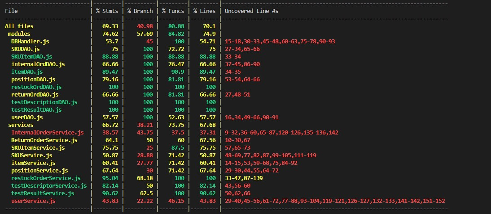

# Unit Testing Report

Date: 25 April 2022
Authors: Abdallah El Mouaatamid, Marziyeh Karani, Omar Ormachea, Francesco Di Gangi
Version: 1.0

# Contents

- [Black Box Unit Tests](#black-box-unit-tests)

- [White Box Unit Tests](#white-box-unit-tests)

# Black Box Unit Tests

    <Define here criteria, predicates and the combination of predicates for each function of each class.
    Define test cases to cover all equivalence classes and boundary conditions.
    In the table, report the description of the black box test case and (traceability) the correspondence with the Jest test case writing the 
    class and method name that contains the test case>
    <Jest tests  must be in code/server/unit_test  >

 ### **Class *userDAO* - method *newUser(username,name,surname,password,type)***
**Criteria for method *newUser(username,name,surname,password,type)*:**
	

 - Username is not given
 - Name is not given
 - Surname is not given
 - Password is not given
 - Type is not given

**Predicates for method *newUser(username,name,surname,password,type)*:**

| Criteria              | Predicate |
| --------------------- | --------- |
| Username is not given | Positive  |
|                       | Negative  |
| Name is not given     | Positive  |
|                       | Negative  |
| Surname is not given  | Positive  |
|                       | Negative  |
| Password is not given | Positive  |
|                       | Negative  |
| Type is not given     | Positive  |
|                       | Negative  |

**Boundaries**:

| Criteria         | Boundary values |
| ---------------- | --------------- |
| Number of fields | >5              |
|                  | =5              |
|                  | <5              |

**Combination of predicates**:

| Criteria 1            | Criteria 2        | Criteria 3           | Criteria 4            | Criteria 5        | Valid / Invalid | Description of the test case                                    | Jest test case |
| --------------------- | ----------------- | -------------------- | --------------------- | ----------------- | --------------- | --------------------------------------------------------------- | -------------- |
| Username is not given | Name is given     | Surname is given     | Password is given     | Type is given     | I               | testNewUser(name,surname,password,type) -> test fails           | testNewUser()  |
| Username is given     | Name is not given | Surname is given     | Password is given     | Type is given     | I               | testNewUser(username,surname,password,type) -> test fails       | testNewUser()  |
| Username is given     | Name is given     | Surname is not given | Password is given     | Type is given     | I               | testNewUser(username,name,password,type) -> test fails          | testNewUser()  |
| Username is given     | Name is given     | Surname is given     | Password is not given | Type is given     | I               | testNewUser(username,name,surname,type) -> test fails           | testNewUser()  |
| Username is given     | Name is given     | Surname is given     | Password is given     | Type is not given | I               | testNewUser(username,name,surname,password) -> test fails       | testNewUser()  |
| Username is given     | Name is given     | Surname is given     | Password is given     | Type is given     | V               | testNewUser(username,name,surname,password,type) -> test passes | testNewUser()  |

### **Class *userDAO* - method *loginUsersAPPDAO(username,password)***

**Criteria for method *loginUsersAPPDAO(username,password)*:**
	
 - Username is undefined
 - Username is not given
 - Username is wrong
 - Passowrd is undefined
 - Password is not given
 - Password is wrong
 - Another role is trying to connect 

**Predicates for method *loginUsersAPPDAO(username,password)*:**

| Criteria                          | Predicate |
| --------------------------------- | --------- |
| Username is undefined             | True      |
|                                   | False     |
| Username is not given             | True      |
|                                   | False     |
| Username is wrong                 | True      |
|                                   | False     |
| Passowrd is undefined             | True      |
|                                   | False     |
| Password is not given             | True      |
|                                   | False     |
| Password is wrong                 | True      |
|                                   | False     |
| Another role is trying to connect | True      |
|                                   | False     |

**Boundaries**:

| Criteria         | Boundary values |
| ---------------- | --------------- |
| Number of fields | >2              |
|                  | =2              |
|                  | <2              |

**Combination of predicates**:

| Criteria 1                | Criteria 2            | Criteria 3            | Criteria 4                | Criteria 5            | Criteria 6            | Criteria 7                        | Valid / Invalid | Description of the test case                    | Jest test case  |
| ------------------------- | --------------------- | --------------------- | ------------------------- | --------------------- | --------------------- | --------------------------------- | --------------- | ----------------------------------------------- | --------------- |
| Username is undefined     | Username is given     | Username is not wrong | Password is not undefined | Password is given     | Password is not wrong | Correct role is trying to connect | I               | testLoginUser(undefined,password) -> test fails | testLoginUser() |
| Username is not undefined | Username is not given | Username is not wrong | Password is not undefined | Password is given     | Password is not wrong | Correct role is trying to connect | I               | testLoginUser(password) -> test fails           | testLoginUser() |
| Username is undefined     | Username is given     | Username is wrong     | Password is not undefined | Password is given     | Password is not wrong | Correct role is trying to connect | I               | testLoginUser(username,password) -> test fails  | testLoginUser() |
| Username is undefined     | Username is given     | Username is wrong     | Password is undefined     | Password is given     | Password is not wrong | Correct role is trying to connect | I               | testLoginUser(username,undefined) -> test fails | testLoginUser() |
| Username is undefined     | Username is given     | Username is wrong     | Password is not undefined | Password is not given | Password is not wrong | Correct role is trying to connect | I               | testLoginUser(username) -> test fails           | testLoginUser() |
| Username is undefined     | Username is given     | Username is wrong     | Password is not undefined | Password is given     | Password is wrong     | Correct role is trying to connect | I               | testLoginUser(username,password) -> test fails  | testLoginUser() |
| Username is undefined     | Username is given     | Username is wrong     | Password is not undefined | Password is given     | Password is not wrong | Another role is trying to connect | I               | testLoginUser(username,password) -> test fails  | testLoginUser() |
| Username is not undefined | Username is not given | Username is not wrong | Password is not undefined | Password is not given | Password is not wrong | Another role is trying to connect | I               | testLoginUser(username,password) -> test fails  | testLoginUser() |
| Username is not undefined | Username is given     | Username is not wrong | Password is not undefined | Password is given     | Password is not wrong | Correct role is trying to connect | V               | testLoginUser(username,password) -> test passes | testLoginUser() |

### **Class *userDAO* - method *modifyRights(username,newType,oldType)***

**Criteria for method *modifyRights(username,newType,oldType)*:**
	
 - Username is undefined
 - Username is not given
 - Username is wrong
 - Old type is wrong
 - Old type is not given
 - Old type is undefined
 - New type is wrong
 - New type is not given
 - New type is undefined
 - Trying to modify right of an admin/manager

**Predicates for method *modifyRights(username,newType,oldType)*:**

| Criteria                                   | Predicate |
| ------------------------------------------ | --------- |
| Username is undefined                      | True      |
|                                            | False     |
| Username is not given                      | True      |
|                                            | False     |
| Username is wrong                          | True      |
|                                            | False     |
| Old type is wrong                          | True      |
|                                            | False     |
| Old type is not given                      | True      |
|                                            | False     |
| Old type is undefined                      | True      |
|                                            | False     |
| New type is wrong                          | True      |
|                                            | False     |
| New type is not given                      | True      |
|                                            | False     |
| New type is undefined                      | True      |
|                                            | False     |
| Trying to modify right of an admin/manager | True      |
|                                            | False     |

**Boundaries**:

| Criteria         | Boundary values |
| ---------------- | --------------- |
| Number of fields | >3              |
|                  | =3              |
|                  | <3              |

**Combination of predicates**:

| Criteria 1                | Criteria 2            | Criteria 3            | Criteria 4                | Criteria 5            | Criteria 6            | Criteria 7            | Criteria 8            | Criteria 9                | Criteria 10                                    | Valid / Invalid | Description of the test case                              | Jest test case   |
| ------------------------- | --------------------- | --------------------- | ------------------------- | --------------------- | --------------------- | --------------------- | --------------------- | ------------------------- | ---------------------------------------------- | --------------- | --------------------------------------------------------- | ---------------- |
| Username is undefined     | Username is given     | Username is not wrong | Old Type is not undefined | Old Type is given     | Old Type is wrong     | New Type is wrong     | New type is given     | New type is not undefined | Not trying to modify right of an admin/manager | I               | testModifyUser(undefined,oldType,newType) -> test fails   | testModifyUser() |
| Username is not undefined | Username is not given | Username is not wrong | Old Type is not undefined | Old Type is not given | Old Type is not wrong | New Type is not wrong | New type is not given | New type is not undefined | Not trying to modify right of an admin/manager | I               | testModifyUser(oldType,newType) -> test fails             | testModifyUser() |
| Username is not undefined | Username is given     | Username is wrong     | Old Type is not undefined | Old Type is given     | Old Type is wrong     | New Type is wrong     | New type is given     | New type is not undefined | Not trying to modify right of an admin/manager | I               | testModifyUser(username,oldType,newType) -> test fails    | testModifyUser() |
| Username is not undefined | Username is given     | Username is not wrong | Old Type is undefined     | Old Type is given     | Old Type is wrong     | New Type is wrong     | New type is given     | New type is not undefined | Not trying to modify right of an admin/manager | I               | testModifyUser(username,undefined,newType) -> test fails  | testModifyUser() |
| Username is not undefined | Username is given     | Username is not wrong | Old Type is not undefined | Old Type is not given | Old Type is wrong     | New Type is wrong     | New type is given     | New type is not undefined | Not trying to modify right of an admin/manager | I               | testModifyUser(username,newType) -> test fails            | testModifyUser() |
| Username is not undefined | Username is given     | Username is not wrong | Old Type is not undefined | Old Type is given     | Old Type is wrong     | New Type is wrong     | New type is given     | New type is not undefined | Not trying to modify right of an admin/manager | I               | testModifyUser(username,oldType,newType) -> test fails    | testModifyUser() |
| Username is not undefined | Username is given     | Username is not wrong | Old Type is not undefined | Old Type is given     | Old Type is not wrong | New Type is wrong     | New type is given     | New type is not undefined | Not trying to modify right of an admin/manager | I               | testModifyUser(username,oldType,newType) -> test fails    | testModifyUser() |
| Username is not undefined | Username is given     | Username is not wrong | Old Type is not undefined | Old Type is given     | Old Type is not wrong | New Type is not wrong | New type is given     | New type is undefined     | Not trying to modify right of an admin/manager | I               | testModifyUser(username,oldType,undefined) -> test fails  | testModifyUser() |
| Username is not undefined | Username is given     | Username is not wrong | Old Type is not undefined | Old Type is given     | Old Type is not wrong | New Type is not wrong | New type is given     | New type is not undefined | Trying to modify right of an admin/manager     | I               | testModifyUser(username,oldType,undefined) -> test fails  | testModifyUser() |
| Username is not undefined | Username is given     | Username is not wrong | Old Type is not undefined | Old Type is given     | Old Type is not wrong | New Type is not wrong | New type is given     | New type is not undefined | Not rying to modify right of an admin/manager  | V               | testModifyUser(username,oldType,undefined) -> test passes | testModifyUser() |

### **Class *positionDAO* - method *modifyPostionByID(id,newAisleID,newRow,newCol,newMaxWeight,newMaxVolume,newOccupiedWeight,newOccupiedVolume)***

**Criteria for method *modifyPostionByID(id,newAisleID,newRow,newCol,newMaxWeight,newMaxVolume,newOccupiedWeight,newOccupiedVolume)*:**

 - Number of fields is less than 8
 - Number of fields is greater than 8
 - Id is wrong (position does not exists)
 - Id is undefined
 - Id is not given
 - One of the parameters is undefined

**Predicates for method *modifyPostionByID(id,newAisleID,newRow,newCol,newMaxWeight,newMaxVolume,newOccupiedWeight,newOccupiedVolume)*:**

| Criteria                               | Predicate |
| -------------------------------------- | --------- |
| Number of fields is less than 8        | True      |
|                                        | False     |
| Number of fields is greater than 8     | True      |
|                                        | False     |
| Id is wrong (position does not exists) | True      |
|                                        | False     |
| Id is undefined                        | True      |
|                                        | False     |
| Id is not given                        | True      |
|                                        | False     |

**Boundaries**:

| Criteria         | Boundary values |
| ---------------- | --------------- |
| Number of fields | >8              |
|                  | =8              |
|                  | <8              |

**Combination of predicates**:

| Criteria 1                                                                                                                                                                                              | Criteria 2                             | Criteria 3                                                                                                                 | Criteria 4                         | Criteria 5      | Criteria 6                                 | Valid / Invalid          | Description of the test case                        | Jest test case           |
| ------------------------------------------------------------------------------------------------------------------------------------------------------------------------------------------------------- | -------------------------------------- | -------------------------------------------------------------------------------------------------------------------------- | ---------------------------------- | --------------- | ------------------------------------------ | ------------------------ | --------------------------------------------------- | ------------------------ |
| Numer of fields is less than 8                                                                                                                                                                          | Number of fields is not greater than 8 | Id is wrong                                                                                                                | Id is not undefined                | Id is given     | One of the parameters is not undefined     | I                        | testModifyPositionByID(id,...) -> test fails        | testModifyPositionByID() |
| Numer of fields is less than 8                                                                                                                                                                          | Number of fields is not greater than 8 | Id is not wrong                                                                                                            | Id is undefined                    | Id is given     | One of the parameters is not undefined     | I                        | testModifyPositionByID(undefined,...) -> test fails | testModifyPositionByID() |
| Numer of fields is less than 8                                                                                                                                                                          | Number of fields is not greater than 8 | Id is not wrong                                                                                                            | Id is not undefined                | Id is given     | One of the parameters is not undefined     | I                        | testModifyPositionByID(id,...) -> test fails        | testModifyPositionByID() |
| Numer of fields is less than 8                                                                                                                                                                          | Number of fields is not greater than 8 | Id is not wrong                                                                                                            | Id is not undefined                | Id is given     | One of the parameters is not undefined     | I                        | testModifyPositionByID(id,...) -> test fails        | testModifyPositionByID() |
| Numer of fields is less than 8                                                                                                                                                                          | Number of fields is not greater than 8 | Id is not wrong                                                                                                            | Id is not undefined                | Id is given     | One of the parameters is undefined         | I                        | testModifyPositionByID(id,...) -> test fails        | testModifyPositionByID() |
| Numer of fields is less than 8                                                                                                                                                                          | Number of fields is not greater than 8 | Id is given	One of the parameters is not undefined	I	testModifyPositionByID(id,...) -> test fails	testModifyPositionByID() |
| Numer of fields is less than 8	Number of fields is not greater than 8	Id is not wrong	Id is not undefined	Id is given	One of the parameters is undefined	I	testModifyPositionByID(id,...) -> tnot wrong | Id is not undefined                    | Id is not given                                                                                                            | One of the parameters is undefined | I               | testModifyPositionByID(,...) -> test fails | testModifyPositionByID() |
| Numer of fields is not less than 8                                                                                                                                                                      | Number of fields is greater than 8     | Id is wrong                                                                                                                | Id is not undefined                | Id is given     | One of the parameters is not undefined     | I                        | testModifyPositionByID(id,...) -> test fails        | testModifyPositionByID() |
| Numer of fields is not less than 8                                                                                                                                                                      | Number of fields is greater than 8     | Id is not wrong                                                                                                            | Id is undefined                    | Id is given     | One of the parameters is not undefined     | I                        | testModifyPositionByID(undefined,...) -> test fails | testModifyPositionByID() |
| Numer of fields is not less than 8                                                                                                                                                                      | Number of fields is greater than 8     | Id is wrong                                                                                                                | Id is not undefined                | Id is given     | One of the parameters is not undefined     | I                        | testModifyPositionByID(id,...) -> test fails        | testModifyPositionByID() |
| Numer of fields is not less than 8                                                                                                                                                                      | Number of fields is greater than 8     | Id is wrong                                                                                                                | Id is not undefined                | Id is not given | One of the parameters is not undefined     | I                        | testModifyPositionByID(...) -> test fails           | testModifyPositionByID() |
| Numer of fields is not less than 8                                                                                                                                                                      | Number of fields is greater than 8     | Id is wrong                                                                                                                | Id is not undefined                | Id is given     | One of the parameters is undefined         | I                        | testModifyPositionByID(id,...) -> test fails        | testModifyPositionByID() |
| Numer of fields is not less than 8                                                                                                                                                                      | Number of fields is not greater than 8 | Id is wrong                                                                                                                | Id is not undefined                | Id is given     | One of the parameters is not undefined     | I                        | testModifyPositionByID(id,...) -> test fails        | testModifyPositionByID() |
| Numer of fields is not less than 8                                                                                                                                                                      | Number of fields is not greater than 8 | Id is not wrong                                                                                                            | Id is undefined                    | Id is given     | One of the parameters is no undefined      | I                        | testModifyPositionByID(undefined,...) -> test fails | testModifyPositionByID() |
| Numer of fields is not less than 8                                                                                                                                                                      | Number of fields is not greater than 8 | Id is not wrong                                                                                                            | Id is not undefined                | Id is not given | One of the parameters is not undefined     | I                        | testModifyPositionByID(...) -> test fails           | testModifyPositionByID() |
| Numer of fields is not less than 8                                                                                                                                                                      | Number of fields is not greater than 8 | Id is not wrong                                                                                                            | Id is not undefined                | Id is given     | One of the parameters is undefined         | I                        | testModifyPositionByID(id,...) -> test fails        | testModifyPositionByID() |
| Numer of fields is not less than 8                                                                                                                                                                      | Number of fields is not greater than 8 | Id is not wrong                                                                                                            | Id is not undefined                | Id is given     | One of the parameters is not undefined     | V                        | testModifyPositionByID(id,...) -> test passes       | testModifyPositionByID() |

### **Class *positionDAO* - method *deletePosition(id)***

**Criteria for method *deletePosition(id)*:**
	
 - Id is not defined
 - Id is wrong
 - Id is not given

**Predicates for method *deletePosition(id)*:**

| Criteria          | Predicate |
| ----------------- | --------- |
| Id is not defined | True      |
|                   | False     |
| Id is not defined | True      |
|                   | False     |
| Id is not given   | True      |
|                   | False     |

**Boundaries**:

| Criteria         | Boundary values |
| ---------------- | --------------- |
| Number of fields | >1              |
|                  | =1              |
|                  | <1              |

**Combination of predicates**:

| Criteria 1        | Criteria 2      | Criteria 3      | Valid / Invalid | Description of the test case                | Jest test case       |
| ----------------- | --------------- | --------------- | --------------- | ------------------------------------------- | -------------------- |
| Id is not defined | Id is not wrong | Id is given     | I               | testDeletePosition(undefined) -> test fails | testDeletePosition() |
| Id is defined     | Id is wrong     | Id is given     | I               | testDeletePosition(id) -> test fails        | testDeletePosition() |
| Id is defined     | Id is not wrong | Id is not given | I               | testDeletePosition() -> test fails          | testDeletePosition() |
| Id is defined     | Id is not wrong | Id is given     | V               | testDeletePosition(id) -> test passes       | testDeletePosition() |

### **Class *itemDAO* - method *getSpecificItem(id)***

**Criteria for method *getSpecificItem(id)*:**
	
 - Id is not defined
 - Id is wrong
 - Id is not given

**Predicates for method *getSpecificItem(id)*:**

| Criteria          | Predicate |
| ----------------- | --------- |
| Id is not defined | True      |
|                   | False     |
| Id is wrong       | True      |
|                   | False     |
| Id is not given   | True      |
|                   | False     |

**Boundaries**:

| Criteria         | Boundary values |
| ---------------- | --------------- |
| Number of fields | >1              |
|                  | =1              |
|                  | <1              |

**Combination of predicates**:

| Criteria 1        | Criteria 2      | Criteria 3      | Valid / Invalid | Description of the test case                 | Jest test case        |
| ----------------- | --------------- | --------------- | --------------- | -------------------------------------------- | --------------------- |
| Id is not defined | Id is not wrong | Id is given     | I               | testGetSpecificItem(undefined) -> test fails | testGetSpecificItem() |
| Id is defined     | Id is wrong     | Id is given     | I               | testGetSpecificItem(id) -> test fails        | testGetSpecificItem() |
| Id is defined     | Id is not wrong | Id is not given | I               | testGetSpecificItem() -> test fails          | testGetSpecificItem() |
| Id is defined     | Id is not wrong | Id is given     | V               | testGetSpecificItem(id) -> test passes       | testGetSpecificItem() |

### **Class *itemDAO* - method *modifyItem(id,newDescription,newPrice)***

**Criteria for method *modifyItem(id,newDescription,newPrice)*:**

 - Id is not defined
 - Id is wrong
 - Id is not given
 - New description is not defined
 - New description is not given
 - New price is not defined
 - New price is not given

**Predicates for method *modifyItem(id,newDescription,newPrice)*:**

| Criteria                       | Predicate |
| ------------------------------ | --------- |
| Id is not defined              | True      |
|                                | False     |
| Id is wrong                    | True      |
|                                | False     |
| Id is not given                | True      |
|                                | False     |
| New description is not defined | True      |
|                                | False     |
| New description is wrong       | True      |
|                                | False     |
| New description is not given   | True      |
|                                | False     |
| New price is not defined       | True      |
|                                | False     |
| New price is wrong             | True      |
|                                | False     |
| New price is not given         | True      |
|                                | False     |

**Boundaries**:

| Criteria         | Boundary values |
| ---------------- | --------------- |
| Number of fields | >3              |
|                  | =3              |
|                  | <3              |

**Combination of predicates**:

| Criteria 1        | Criteria 2        | Criteria 3        | Criteria 4                       | Criteria 5                   | Criteria 6             | Criteria 7                 | Valid / Invalid | Description of the test case                                                    | Jest test case                   |
| ----------------- | ----------------- | ----------------- | -------------------------------- | ---------------------------- | ---------------------- | -------------------------- | --------------- | ------------------------------------------------------------------------------- | -------------------------------- |
| Id is not defined | Item is given     | Item is not wrong | New description is not undefined | New description is given     | New price is given     | New price is not undefined | I               | testModifyItemDescriptionPrice(undefined,newDescription,newPrice) -> test fails | testModifyItemDescriptionPrice() |
| Id is defined     | Item is not given | Item is not wrong | New description is not undefined | New description is given     | New price is given     | New price is not undefined | I               | testModifyItemDescriptionPrice(newDescription,newPrice) -> test fails           | testModifyItemDescriptionPrice() |
| Id is defined     | Item is given     | Item is wrong     | New description is not undefined | New description is given     | New price is given     | New price is not undefined | I               | testModifyItemDescriptionPrice(id,newDescription,newPrice) -> test fails        | testModifyItemDescriptionPrice() |
| Id is defined     | Item is given     | Item is not wrong | New description is undefined     | New description is given     | New price is given     | New price is not undefined | I               | testModifyItemDescriptionPrice(id,undefined,newPrice) -> test fails             | testModifyItemDescriptionPrice() |
| Id is defined     | Item is given     | Item is not wrong | New description is not undefined | New description is not given | New price is given     | New price is not undefined | I               | testModifyItemDescriptionPrice(id,newPrice) -> test fails                       | testModifyItemDescriptionPrice() |
| Id is defined     | Item is given     | Item is not wrong | New description is not undefined | New description is given     | New price is not given | New price is not undefined | I               | testModifyItemDescriptionPrice(id,newDescription) -> test fails                 | testModifyItemDescriptionPrice() |
| Id is defined     | Item is given     | Item is not wrong | New description is not undefined | New description is given     | New price is given     | New price is undefined     | I               | testModifyItemDescriptionPrice(id,undefined) -> test fails                      | testModifyItemDescriptionPrice() |
| Id is defined     | Item is given     | Item is not wrong | New description is not undefined | New description is given     | New price is given     | New price is not undefined | V               | testModifyItemDescriptionPrice(id,undefined) -> test passes                     | testModifyItemDescriptionPrice() |

 ### **Class *restockOrdDAO* - method *addRestockOrder(issuedate, supplierid)***
**Criteria for method *addRestockOrder(issuedate, supplierid)*:**
	

 - issuedate is not given
 - supplierid is not given

**Predicates for method *addRestockOrder(issuedate, supplierid)*:**

| Criteria                | Predicate |
| ----------------------- | --------- |
| issuedate is not given  | Positive  |
|                         | Negative  |
| supplierid is not given | Positive  |
|                         | Negative  |

**Boundaries**:

| Criteria         | Boundary values |
| ---------------- | --------------- |
| Number of fields | >2              |
|                  | =2              |
|                  | <2              |

**Combination of predicates**:

| Criteria 1             | Criteria 2              | Valid / Invalid | Description of the test case                       | Jest test case        |
| ---------------------- | ----------------------- | --------------- | -------------------------------------------------- | --------------------- |
| issuedate is not given | supplierid is given     | I               | testNewRestockOrder(issuedate, qty) -> test fails  | testNewRestockOrder() |
| issuedate is given     | supplierid is not given | I               | testNewRestockOrder(issuedate, qty) -> test fails  | testNewRestockOrder() |
| issuedate is given     | supplierid is given     | V               | testNewRestockOrder(issuedate, qty) -> test passes | testNewRestockOrder() |

### **Class *restockOrdDAO* - method *addROItem(roID, itemID, quantity)***
**Criteria for method *addROItem(roID, itemID, quantity)*:**
	

 - roID is not given
 - itemID is not given
 - quantity is not given

**Predicates for method *addROItem(roID, itemID, quantity)*:**

| Criteria              | Predicate |
| --------------------- | --------- |
| roID is not given     | Positive  |
|                       | Negative  |
| itemID is not given   | Positive  |
|                       | Negative  |
| quantity is not given | Positive  |
|                       | Negative  |

**Boundaries**:

| Criteria         | Boundary values |
| ---------------- | --------------- |
| Number of fields | >3              |
|                  | =3              |
|                  | <3              |

**Combination of predicates**:

| Criteria 1        | Criteria 2          | Criteria 3            | Valid / Invalid | Description of the test case     | Jest test case  |
| ----------------- | ------------------- | --------------------- | --------------- | -------------------------------- | --------------- |
| roID is not given | itemID is given     | quantity is given     | I               | (ID, itemID, qty) -> test fails  | testNewROItem() |
| roID is given     | itemID is not given | quantity is given     | I               | (ID, itemID, qty) -> test fails  | testNewROItem() |
| roID is given     | itemID is given     | quantity is not given | I               | (ID, itemID, qty) -> test fails  | testNewROItem() |
| roID is given     | itemID is given     | quantity is given     | V               | (ID, itemID, qty) -> test passes | testNewROItem() |

### **Class *restockOrdDAO* - method *modifyStateByID(ID, state)***
**Criteria for method *modifyStateByID(ID, state)*:**
	
 - ID is not given
 - state is not given
 - ID is not found in the database

**Predicates for method *modifyStateByID(ID, state)*:**

| Criteria                        | Predicate |
| ------------------------------- | --------- |
| ID is not given                 | Positive  |
|                                 | Negative  |
| state is not given              | Positive  |
|                                 | Negative  |
| ID is not found in the database | Positive  |
|                                 | Negative  |

**Boundaries**:

| Criteria         | Boundary values |
| ---------------- | --------------- |
| Number of fields | >2              |
|                  | =2              |
|                  | <2              |

**Combination of predicates**:

| Criteria 1      | Criteria 2         | Criteria 3                      | Valid / Invalid | Description of the test case              | Jest test case    |
| --------------- | ------------------ | ------------------------------- | --------------- | ----------------------------------------- | ----------------- |
| ID is not given | state is given     | -                               | I               | testModifyState(ID, state) -> test fails  | testModifyState() |
| ID is given     | state is not given | ID is found in the database     | I               | testModifyState(ID, state) -> test fails  | testModifyState() |
| ID is given     | state is given     | ID is not found in the database | I               | testModifyState(ID, state) -> test fails  | testModifyState() |
| ID is given     | state is given     | ID is found in the database     | V               | testModifyState(ID, state) -> test passes | testModifyState() |

### **Class *restockOrdDAO* - method *addTransportNote(ID, date)***
**Criteria for method *addTransportNote(ID, date)*:**
	
 - ID is not given
 - date is not given
 - ID is not found in the database

**Predicates for method *addTransportNote(ID, date)*:**

| Criteria                        | Predicate |
| ------------------------------- | --------- |
| ID is not given                 | Positive  |
|                                 | Negative  |
| date is not given               | Positive  |
|                                 | Negative  |
| ID is not found in the database | Positive  |
|                                 | Negative  |

**Boundaries**:

| Criteria         | Boundary values |
| ---------------- | --------------- |
| Number of fields | >2              |
|                  | =2              |
|                  | <2              |

**Combination of predicates**:

| Criteria 1      | Criteria 2        | Criteria 3                      | Valid / Invalid | Description of the test case          | Jest test case |
| --------------- | ----------------- | ------------------------------- | --------------- | ------------------------------------- | -------------- |
| ID is not given | date is given     | -                               | I               | testAddTNote(ID, date) -> test fails  | testAddTNote() |
| ID is given     | date is not given | ID is found in the database     | I               | testAddTNote(ID, date) -> test fails  | testAddTNote() | ) |
| ID is given     | date is given     | ID is not found in the database | I               | testAddTNote(ID, date) -> test fails  | testAddTNote() | ) |
| ID is given     | date is given     | ID is found in the database     | V               | testAddTNote(ID, date) -> test passes | testAddTNote() | ) |

 ### **Class *internalOrdDAO* - method *addInternalOrder***
**Criteria for method *addInternalOrder(issueDate, customerId)*:**
 - issueDate is not given
 - customerId is not given

| Criteria                | Predicate |
| ----------------------- | --------- |
| issueDate is not given  | positive  |
|                         | negative  |
| customerId is not given | positive  |
|                         | negative  |

	
**Boundaries**:

| Criteria         | Boundary values |
| ---------------- | --------------- |
| Number of fields | >2              |
|                  | =2              |
|                  | <2              |

**Combination of predicates**:

| Criteria 1             | Criteria 2              | Valid / Invalid | Description of the test case                              | Jest test case          |
| ---------------------- | ----------------------- | --------------- | --------------------------------------------------------- | ----------------------- |
| issuedate is not given | customerId is not given | I               | testNewInternalOrder(issueDate,customerId) -> test fails  | testNewInternalOrder(); |
| issuedate is not given | customerId is given     | I               | testNewInternalOrder(issueDate,customerId)-> test fails   | testNewInternalOrder(); |
| issuedate is given     | customerId is not given | I               | testNewInternalOrder(issueDate,customerId)-> test fails   | testNewInternalOrder(); |
| issuedate is given     | customerId is given     | V               | testNewInternalOrder(issueDate,customerId) -> test passes | testNewInternalOrder(); |

 ### **Class *internalOrdDAO* - method *getProductsByID***
**Criteria for method *getProductsByID(ID, STATE)*:**
 - ID is not given
 - state is not given
**Predicates for method *getProductsByID(ID, STATE)*:**

| Criteria           | Predicate |
| ------------------ | --------- |
| Id is not given    | True      |
|                    | False     |
| State is not given | True      |
|                    | False     |

**Boundaries**:

| Criteria         | Boundary values |
| ---------------- | --------------- |
| Number of fields | >2              |
|                  | =2              |
|                  | <2              |

| Criteria 1      | Criteria 2         | Valid / Invalid | Description of the test case | Jest test case     |
| --------------- | ------------------ | --------------- | ---------------------------- | ------------------ |
| id is not given | state is not given | I               | testGetProductByID(ID,STATE) | testGetProductBy() |
| id is not given | state is given     | I               | testGetProductByID(ID,STATE) | testGetProductBy() |
| id is given     | state is not given | I               | testGetProductByID(ID,STATE) | testGetProductBy() |
| id is given     | state is given     | V               | testGetProductByID(ID,STATE) | testGetProductBy() |

 ### **Class *internalOrdDAO* - method *getInternalOrderByID***
**Criteria for method *getInternalOrderByID(ID)*:**
 - Id is not defined
 - Id is wrong
 - Id is not given

**Predicates for method *getInternalOrderByID(ID)*:**

| Criteria          | Predicate |
| ----------------- | --------- |
| Id is not defined | True      |
|                   | False     |
| Id is wrong       | True      |
|                   | False     |
| Id is not given   | True      |
|                   | False     |

**Boundaries**:

| Criteria         | Boundary values |
| ---------------- | --------------- |
| Number of fields | >1              |
|                  | =1              |
|                  | <1              |

| Criteria 1        | Criteria 2      | Criteria 3      | Valid / Invalid | Description of the test case            | Jest test case         |
| ----------------- | --------------- | --------------- | --------------- | --------------------------------------- | ---------------------- |
| Id is not defined | Id is not wrong | Id is given     | I               | getInternalOrderByID(id) -> test fails  | getInternalOrderByID() |
| Id is defined     | Id is wrong     | Id is given     | I               | getInternalOrderByID(id) -> test fails  | getInternalOrderByID() |
| Id is defined     | Id is not wrong | Id is not given | I               | getInternalOrderByID(id) -> test fails  | getInternalOrderByID() |
| Id is defined     | Id is not wrong | Id is given     | V               | getInternalOrderByID(id) -> test passes | getInternalOrderByID() |

 ### **Class *internalOrdDAO* - method *addCompletedItem***
**Criteria for method *addCompletedItem(ID, SKUID, RFID)*:**

 - ID is not given
 - SKUID is not given
 - RFID is not given

**Predicates for method *addCompletedItem(ID, SKUID, RFID)*:**

| Criteria           | Predicate |
| ------------------ | --------- |
| ID is not given    | Positive  |
|                    | Negative  |
| SKUID is not given | Positive  |
|                    | Negative  |
| RFID is not given  | Positive  |
|                    | Negative  |

**Boundaries**:

| Criteria         | Boundary values |
| ---------------- | --------------- |
| Number of fields | >3              |
|                  | =3              |
|                  | <3              |

**Combination of predicates**:

| Criteria 1      | Criteria 2         | Criteria 3        | Valid / Invalid | Description of the test case                         | Jest test case         |
| --------------- | ------------------ | ----------------- | --------------- | ---------------------------------------------------- | ---------------------- |
| ID is not given | SKUID is given     | RFID is given     | I               | testAddCompletedItem(ID,SKUID,RFID) -> test fails    | testAddCompletedItem() |
| ID is given     | SKUID is not given | RFID is given     | I               | testAddCompletedItem(ID, SKUID, RFID) -> test fails  | testAddCompletedItem() |
| ID is given     | SKUID is given     | RFID is not given | I               | testAddCompletedItem(ID, SKUID, RFID) -> test fails  | testAddCompletedItem() |
| ID is given     | SKUID is given     | RFID is given     | V               | testAddCompletedItem(ID, SKUID, RFID) -> test passes | testAddCompletedItem() |

 ### **Class *returnOrdDAO* - method *getOrderByID(ID)***
**Criteria for method *getOrderByID(ID)*:**
 - Id is not defined
 - Id is wrong
 - Id is not given

**Predicates for method *getOrderByID(ID)*:**

| Criteria          | Predicate |
| ----------------- | --------- |
| Id is not defined | True      |
|                   | False     |
| Id is not defined | True      |
|                   | False     |
| Id is not given   | True      |
|                   | False     |

**Boundaries**:

| Criteria         | Boundary values |
| ---------------- | --------------- |
| Number of fields | >1              |
|                  | =1              |
|                  | <1              |

| Criteria 1        | Criteria 2      | Criteria 3      | Valid / Invalid | Description of the test case        | Jest test case     |
| ----------------- | --------------- | --------------- | --------------- | ----------------------------------- | ------------------ |
| Id is not defined | Id is not wrong | Id is given     | I               | testGetOrderByID(id) -> test fails  | testGetOrderByID() |
| Id is defined     | Id is wrong     | Id is given     | I               | testGetOrderByID(id) -> test fails  | testGetOrderByID() |
| Id is defined     | Id is not wrong | Id is not given | I               | testGetOrderByID(id) -> test fails  | testGetOrderByID() |
| Id is defined     | Id is not wrong | Id is given     | V               | testGetOrderByID(id) -> test passes | testGetOrderByID() |

### **Class *returnOrdDAO* - method *addReturnOrder***
**Criteria for method *addReturnOrder(reoid,returnDate)*:**
 - returnDate is not given
 - reoid is not given

| Criteria                | Predicate |
| ----------------------- | --------- |
| returnDate is not given | positive  |
|                         | negative  |
| reoid is not given      | positive  |
|                         | negative  |

	
**Boundaries**:

| Criteria         | Boundary values |
| ---------------- | --------------- |
| Number of fields | >2              |
|                  | =2              |
|                  | <2              |

**Combination of predicates**:

| Criteria 1              | Criteria 2         | Valid / Invalid | Description of the test case                           | Jest test case          |
| ----------------------- | ------------------ | --------------- | ------------------------------------------------------ | ----------------------- |
| returnDate is not given | reoid is not given | I               | testNewInternalOrder(returnDate,reoid); -> test fails  | testNewInternalOrder(); |
| returnDate is not given | reoid is given     | I               | testNewInternalOrder(returnDate,reoid); -> test fails  | testNewInternalOrder(); |
| returnDate is given     | reoid is not given | I               | testNewInternalOrder(returnDate,reoid); -> test fails  | testNewInternalOrder(); |
| returnDate is given     | reoid is given     | V               | testNewInternalOrder(returnDate,reoid); -> test passes | testNewInternalOrder(); |

### **Class *returnOrdDAO* - method * addReturnItem***
**Criteria for method * addReturnItem(id, rfid)*:**

 - ID is not given
 - rfid is not given

**Predicates for method *addReturnItem(id, rfid)*:**

| Criteria          | Predicate |
| ----------------- | --------- |
| ID is not given   | Positive  |
|                   | Negative  |
| rfid is not given | Positive  |
|                   | Negative  |

**Boundaries**:

| Criteria         | Boundary values |
| ---------------- | --------------- |
| Number of fields | >2              |
|                  | =2              |
|                  | <2              |

**Combination of predicates**:

| Criteria 1      | Criteria 2        | Valid / Invalid | Description of the test case              | Jest test case      |
| --------------- | ----------------- | --------------- | ----------------------------------------- | ------------------- |
| ID is not given | rfid is given     | I               | testaddReturnItem(rfid) -> test fails     | testaddReturnItem() |
| ID is given     | rfid is not given | I               | testaddReturnItem(rfid) -> test fails     | testaddReturnItem() |
| ID is given     | rfid is given     | V               | testaddReturnItem(id,rfid) -> test passes | testaddReturnItem() |

### **Class *SKUDAO* - method * addSKU***

- description is not given
- weight is not given
- volume is not given
- notes is not given
- price is not given
- availableQuantity is not given

**Criteria for method * addSKU(description,weight,volume,notes,price,availableQuantity)*:**

| Criteria           | Predicate |
| ------------------ | --------- |
| description is not given   | Positive  |
|                    | Negative  |
| weight is not given | Positive  |
|                    | Negative  |
| volume is not given  | Positive  |
|                    | Negative  |
| notes is not given | Positive  | 
|                    | Negative  |
| price is not given | Positive  | 
|                    | Negative  |
| availableQuantity is not given | Positive  | 
|                    | Negative  |

**Boundaries**:

| Criteria         | Boundary values |
| ---------------- | --------------- |
| Number of fields | >6              |
|                  | =6              |
|                  | <6              |

**Combination of predicates**:

| Criteria 1                | Criteria 2            | Criteria 3            | Criteria 4                | Criteria 5            | Criteria 6            |  Valid / Invalid | Description of the test case                    | Jest test case  |
| ------------------------- | --------------------- | --------------------- | ------------------------- | --------------------- | ---------------------  | --------------- | ----------------------------------------------- | --------------- |
| description is given     | weight is not given     | volume is not given | notes is not given | price is not given     | availableQuantity is not given |  I               | testNewSKU(descrition,weight,volume,notes,price,availableQuantity) -> test fails | testNewSKU() |
| description is given     | weight is given     | volume is given | notes is given | price is not given     | availableQuantity is not given |  I               | testNewSKU(descrition,weight,volume,notes,price,availableQuantity) -> test fails | testNewSKU() |
| description is given     | weight is given     | volume is given | notes is given | price is given     | availableQuantity is given |  V               | testNewSKU(descrition,weight,volume,notes,price,availableQuantity) -> test Passes | testNewSKU() |

### **Class *SKUDAO* - method * SetPosition***

**Criteria for method * setPosition(id,positionId)*:**

- id is not given
- The given id is in the database
- positionId is not given
- The given positionId is in the database

| Criteria           | Predicate |
| ------------------ | --------- |
| id is not given   | Positive  |
|                    | Negative  |
| The given id is in the database   | Positive  |
|                    | Negative  |
| positionId is not given | Positive  |
|                    | Negative  |
| The given positionId is in the database | Positive  |
|                    | Negative  |

**Boundaries**:

| Criteria         | Boundary values |
| ---------------- | --------------- |
| Number of fields | >2              |
|                  | =2              |
|                  | <2             |

**Combination of predicates**:

| Criteria 1      | Criteria 2 | Criteria 3 | Criteria 4        | Valid / Invalid | Description of the test case              | Jest test case      |
| --------------- | ----------------- | --------------- | --------------- |--------------- |----------------------------------------- | ------------------- |
| id is not given |   |positionId is not given|    | I               | testSetPosition(id,positionId) -> test fails     | testSetPosition() |
| id is given  |The given id is in the database   | positionId is not given || I               | testSetPosition(id,positionId) -> test fails     | testSetPosition() |
| id is not given |   |positionId is  given| The given positionId is in the database  | I               | testSetPosition(id,positionId) -> test fails     | testSetPosition() |
| id is given     | The given id is in the database  | positionId is given|  The given positionId is in the database | V               | testSetPosition(id,positionId) -> test passes | testSetPosition() |
| id is given     | The given id is not in the database  | positionId is given|  The given positionId is in the database | I               | testSetPosition(id,positionId) -> test fails | testSetPosition() |
| id is given     | The given id is in the database  | positionId is given|  The given positionId is not in the database | I               | testSetPosition(id,positionId) -> test fails | testSetPosition() |

### **Class *SKUItemDAO* - method * addSKUITEM***

**Criteria for method * addSKUITEM(rfid,skuId,stockDate)*:**
- rfid is not given
- skuId is not given
- The given skuId is in the database
- stockDate is not given

| Criteria           | Predicate |
| ------------------ | --------- |
| rfid is not given   | Positive  |
|                    | Negative  |
| skuId is not given   | Positive  |
|                    | Negative  |
| The given skuId is in the database | Positive  |
|                    | Negative  |
| stockDate is not given | Positive  |
|                    | Negative  |

**Boundaries**:

| Criteria         | Boundary values |
| ---------------- | --------------- |
| Number of fields | >3              |
|                  | =3              |
|                  | <3             |

**Combination of predicates**:

| Criteria 1      | Criteria 2 | Criteria 3 | Criteria 4        | Valid / Invalid | Description of the test case              | Jest test case      |
| --------------- | ----------------- | --------------- | --------------- |--------------- |----------------------------------------- | ------------------- |
| rfid is not given | skuId is  given  | The given skuId is in the database| stockDate is not given   | I               | testNewSKUItem(rfid,skuId,stockDate) -> test fails     | testNewSKUItem() |
| rfid is given | skuId is  given  | The given skuId is not in the database| stockDate is  given   | I               | testNewSKUItem(rfid,skuId,stockDate) -> test fails     | testNewSKUItem() |
| rfid is given | skuId is not given  | | stockDate is  given   | I               | testNewSKUItem(rfid,skuId,stockDate) -> test fails     | testNewSKUItem() |
| rfid is given     | skuId is given  | The given skuId is in the database|  stockDate is  given | V               | testSetPosition(id,positionId) -> test passes | testSetPosition() |

### **Class *SKUItemDAO* - method * updateSKUITEM***

**Criteria for method * updateSKUITEM(rfid,newRfid,available,stockDate)*:**

- rfid is not given
- The given rfid is in the database 
- newRfid is not given
- The given newRfid already exists in the database
- available is not given
- stockDate is not given

| Criteria           | Predicate |
| ------------------ | --------- |
| rfid is not given   | Positive  |
|                    | Negative  |
| The given rfid is in the database   | Positive  |
|                    | Negative  |
| newRfid is not given   | Positive  |
|                    | Negative  |
| The given newRfid already exists in the database  | Positive  |
|                    | Negative  |
| available is not given | Positive  |
|                    | Negative  |
| stockDate is not given | Positive  |
|                    | Negative  |

**Boundaries**:

| Criteria         | Boundary values |
| ---------------- | --------------- |
| Number of fields | >4              |
|                  | =4              |
|                  | <4             |

**Combination of predicates**:

| Criteria 1      | Criteria 2 | Criteria 3 | Criteria 4 |Criteria 5|Criteria 6       | Valid / Invalid | Description of the test case              | Jest test case      |
| --------------- | ----------------- | --------------- | --------------- | --------------- | --------------- |--------------- |----------------------------------------- | ------------------- |
| rfid is not given |   | newRfid is given| The given newRfid already exists in the database |available is not given|stockDate is not given  | I               | testUpdateSKUItem(rfid,newRfid,available,stockDate) -> test fails     | testUpdateSKUItem() |
| rfid is given |  The given rfid is in the database | newRfid is not given| |available is given|stockDate is given  | I               | testUpdateSKUItem(rfid,newRfid,available,stockDate) -> test fails     | testUpdateSKUItem() |
| rfid is given | The given rfid is not in the database  | newRfid is given| The given newRfid is not in the database |available is not given|stockDate is not given  | I               | testUpdateSKUItem(rfid,newRfid,available,stockDate) -> test fails     | testUpdateSKUItem() |
| rfid is given | The given rfid is in the database  | newRfid is given| The given newRfid already exists in the database |available is given|stockDate is given  | I               | testUpdateSKUItem(rfid,newRfid,available,stockDate) -> test fails     | testUpdateSKUItem() |
| rfid is given | The given rfid is in the database  | newRfid is given| The given newRfid is not in the database |available is given|stockDate is given  | V               | testUpdateSKUItem(rfid,newRfid,available,stockDate) -> test passes     | testUpdateSKUItem() |

### **Class *SKUItemDAO* - method * getbySKUID***

**Criteria for method * getbySKUID(skuId)*:**

- skuId is not given
- The given skuId is in the database

| Criteria           | Predicate |
| ------------------ | --------- |
| skuId is not given   | Positive  |
|                    | Negative  |
| The given skuId is in the database | Positive  |
|                    | Negative  |

**Boundaries**:

| Criteria         | Boundary values |
| ---------------- | --------------- |
| Number of fields | >1              |
|                  | =1              |
|                  | <1             |

**Combination of predicates**:
| Criteria 1      | Criteria 2   | Valid / Invalid | Description of the test case              | Jest test case      |
| --------------- | ----------------- |--------------- |----------------------------------------- | ------------------- |
| skuId is not given |     | I               | testGetbySKUId(id) -> test fails     | testGetbySKUId() |
| skuId is given |  The given skuId is not in the database   | I               | testGetbySKUId(id) -> test fails     | testGetbySKUId() |
| skuId is given  | The given skuId is in the database| V               | testGetbySKUId(id)  -> test passes | testGetbySKUId() |

### **Class *testDescriptionDAO* - method * addTESTDESCRIPTOR***

**Criteria for method * addTESTDESCRIPTOR(name,procedureDescription,idSKU)*:**

- name is not given
- procedureDescription is not given
- idSKU is not given
- The given idSKU is in the database

| Criteria           | Predicate |
| ------------------ | --------- |
| name is not given   | Positive  |
|                    | Negative  |
| procedureDescription is not given   | Positive  |
|                    | Negative  |
| idSKU is not given   | Positive  |
|                    | Negative  |
| The given idSKU is in the database | Positive  |
|                    | Negative  |

**Boundaries**:

| Criteria         | Boundary values |
| ---------------- | --------------- |
| Number of fields | >3              |
|                  | =3              |
|                  | <3             |

**Combination of predicates**:
| Criteria 1      | Criteria 2 | Criteria 3 |Criteria 4    | Valid / Invalid | Description of the test case              | Jest test case      |
| --------------- | ----------------- |--------------- |--------------- |--------------- |----------------------------------------- | ------------------- |
|name is not given| procedureDescription is not given |idSKU is not given |     | I               | testNewTestDescriptor(name,procedureDescription,idSKU) -> test fails     | testNewTestDescriptor() |
|name is  given| procedureDescription is  given | skuId is given |  The given skuId is not in the database   | I               | testNewTestDescriptor(name,procedureDescription,idSKU) -> test fails     | testNewTestDescriptor() |
|name is given| procedureDescription is  given | skuId is not given |     | I               | testNewTestDescriptor(name,procedureDescription,idSKU) -> test fails     | testNewTestDescriptor() |
|name is given| procedureDescription is  given | skuId is given  | The given skuId is in the database| V               | testNewTestDescriptor(name,procedureDescription,idSKU)  -> test passes | testNewTestDescriptor() |

### **Class *testDescriptionDAO* - method * updateTESTDESCRIPTOR***

**Criteria for method * updateTESTDESCRIPTOR(id,name,procedureDescription,idSKU)*:**

- id is not given
- The given id is in the database
- name is not given
- procedureDescription is not given
- idSKU is not given
- The given idSKU is  in the database

| Criteria           | Predicate |
| ------------------ | --------- |
| id is not given   | Positive  |
|                    | Negative  |
| The given id is in the database | Positive  |
|                    | Negative  |
| name is not given   | Positive  |
|                    | Negative  |
| procedureDescription is not given   | Positive  |
|                    | Negative  |
| idSKU is not given   | Positive  |
|                    | Negative  |
| The given idSKU is in the database | Positive  |
|                    | Negative  |

**Boundaries**:

| Criteria         | Boundary values |
| ---------------- | --------------- |
| Number of fields | >4              |
|                  | =4              |
|                  | <4             |

**Combination of predicates**:
| Criteria 1      | Criteria 2| Criteria 3      | Criteria 4 | Criteria 5 |Criteria 6    | Valid / Invalid | Description of the test case              | Jest test case      |
| --------------- | -----------------| --------------- | ----------------- |--------------- |--------------- |--------------- |----------------------------------------- | ------------------- |
|id is not given||name is not given| procedureDescription is not given |idSKU is not given |     | I               | testUpdateTestDescriptor(id,name,procedureDescription,idSKU) -> test fails     | testUpdateTestDescriptor() |
|id is not given||name is  given| procedureDescription is  given | skuId is given |  The given skuId is not in the database   | I               | testUpdateTestDescriptor(id,name,procedureDescription,idSKU) -> test fails     | testUpdateTestDescriptor() |
|id is given| The given id is in the database |name is given| procedureDescription is  given | skuId is not given |     | I               | testUpdateTestDescriptor(id,name,procedureDescription,idSKU) -> test fails     | testUpdateTestDescriptor() |
|id is given| The given id is in the database |name is given| procedureDescription is  given | skuId is not given |     | I               | testUpdateTestDescriptor(id,name,procedureDescription,idSKU) -> test fails     | testUpdateTestDescriptor() |
|id is given| The given id is not in the database |name is given| procedureDescription is  given | skuId is given | The given skuId is not in the database    | I               | testUpdateTestDescriptor(id,name,procedureDescription,idSKU) -> test fails     | testUpdateTestDescriptor() |
|id is given|The given id is in the database|name is given| procedureDescription is  given | skuId is given  | The given skuId is in the database| V               | testUpdateTestDescriptor(id,name,procedureDescription,idSKU)  -> test passes | testUpdateTestDescriptor() |

### **Class *testDescriptionDAO* - method * deleteTESTDESCRIPTOR***

**Criteria for method * deleteTESTDESCRIPTOR(id)*:**

- id is not given
- The given id is in the database

| Criteria           | Predicate |
| ------------------ | --------- |
| id is not given   | Positive  |
|                    | Negative  |
| The given id is in the database | Positive  |
|                    | Negative  |

**Boundaries**:

| Criteria         | Boundary values |
| ---------------- | --------------- |
| Number of fields | >1              |
|                  | =1              |
|                  | <1             |

**Combination of predicates**:
| Criteria 1      | Criteria 2   | Valid / Invalid | Description of the test case              | Jest test case      |
| --------------- | ----------------- |--------------- |----------------------------------------- | ------------------- |
| id is not given |     | I               | testDeleteTestDescriptor(id) -> test fails     | testDeleteTestDescriptor() |
| id is given |  The given id is not in the database   | I               | testDeleteTestDescriptor(id) -> test fails     | testDeleteTestDescriptor() |
| id is given  | The given id is in the database| V               | testDeleteTestDescriptor(id)  -> test passes | testDeleteTestDescriptor() |

### **Class *testResultDAO* - method * addTESTRESULT***

**Criteria for method *  addTESTRESULT(rfid,idTestDescriptor,Date,Result)*:**

- rfid is not given
- The given rfid is in the database
- idTestDescriptor is not given
- The given idTestDescriptor is in the database
- Date is not given
- Result is not given

| Criteria           | Predicate |
| ------------------ | --------- |
| rfid is not given   | Positive  |
|                    | Negative  |
|  The given rfid is in the database   | Positive  |
|                    | Negative  |
| idTestDescriptor is not given   | Positive  |
|                    | Negative  |
| The given idTestDescriptor is in the database | Positive  |
|                    | Negative  |
| Date is not given   | Positive  |
|                    | Negative  |
| Result is not given   | Positive  |
|                    | Negative  |

**Boundaries**:

| Criteria         | Boundary values |
| ---------------- | --------------- |
| Number of fields | >4              |
|                  | =4              |
|                  | <4             |

**Combination of predicates**:
| Criteria 1      | Criteria 2 | Criteria 3 |Criteria 4  |Criteria 5  |Criteria 6    | Valid / Invalid | Description of the test case              | Jest test case      |
| --------------- | ----------------- |--------------- |--------------- |---------------|--------------- |--------------- |----------------------------------------- | ------------------- |
|rfid is not given|  |idTestDescriptor is not given |  |Date is not given| Result is not given  | I               | testNewTestResult(rfid,idTestDescriptor,date,result) -> test fails     | testNewTestResult() |
() |
|rfid is not given|  |idTestDescriptor is not given |  |Date is not given| Result is not given  | I               | testNewTestResult(rfid,idTestDescriptor,date,result) -> test fails     | testNewTestResult() |
() |
|rfid is not given|  |idTestDescriptor is  given | The given idTestDescriptor is in the database |Date is  given| Result is not given  | I               | testNewTestResult(rfid,idTestDescriptor,date,result) -> test fails     | testNewTestResult() |
() |
|rfid is given|The given rfid is not in the database   |idTestDescriptor is not given |  |Date is given| Result is given  | I               | testNewTestResult(rfid,idTestDescriptor,date,result) -> test fails     | testNewTestResult() |
() |
|rfid is given|The given rfid is not in the database  |idTestDescriptor is given | The given idTestDescriptor is in the database |Date is given| Result is given  | I               | testNewTestResult(rfid,idTestDescriptor,date,result) -> test fails     | testNewTestResult() |
() |
|rfid is given|The given rfid is in the database  |idTestDescriptor is given | The given idTestDescriptor is not in the database |Date is given| Result is given  | I               | testNewTestResult(rfid,idTestDescriptor,date,result) -> test fails     | testNewTestResult() |
() |
|rfid is given|The given rfid is in the database  |idTestDescriptor is given | The given idTestDescriptor is in the database |Date is given| Result is given  | I               | testNewTestResult(rfid,idTestDescriptor,date,result) -> test passes     | testNewTestResult() |
() |

### **Class *testResultDAO* - method * updateTESTRESULT***

**Criteria for method *  updateTESTRESULT(id,rfid,newIdTestDescriptor,newDate,newResult)*:**

- id is not given
- The given id is in the database
- rfid is not given
- The given rfid is in the database
- newIdTestDescriptor is not given
- The given newIdTestDescriptor is in the database
- newDate is not given
- newResult is not given

| Criteria           | Predicate |
| ------------------ | --------- |
| id is not given   | Positive  |
|                    | Negative  |
|  The given id is in the database   | Positive  |
|                    | Negative  |
| rfid is not given   | Positive  |
|                    | Negative  |
|  The given rfid is in the database   | Positive  |
|                    | Negative  |
| newIdTestDescriptor is not given   | Positive  |
|                    | Negative  |
| The given newIdTestDescriptor is in the database | Positive  |
|                    | Negative  |
| newDate is not given   | Positive  |
|                    | Negative  |
| newResult is not given   | Positive  |
|                    | Negative  |

**Boundaries**:

| Criteria         | Boundary values |
| ---------------- | --------------- |
| Number of fields | >5              |
|                  | =5              |
|                  | <5             |

**Combination of predicates**:
| Criteria 1      | Criteria 2| Criteria 3      | Criteria 4 | Criteria 5 |Criteria 6  |Criteria 7 |Criteria 8    | Valid / Invalid | Description of the test case              | Jest test case      |
| --------------- | -----------------| --------------- | ----------------- |--------------- |--------------- |---------------|--------------- |--------------- |----------------------------------------- | ------------------- |
|id is not given| |rfid is not given|  |newIdTestDescriptor is not given |  |newDate is not given| newResult is not given  | I               | testUpdateTestResult(id,rfid,idTestDescriptor,date,result) -> test fails     | testUpdateTestResult() |
() |
|id is given| The given id is in the database |rfid is not given|  |newIdTestDescriptor is not given |  |newDate is not given| newResult is not given  | I               | testUpdateTestResult(id,rfid,idTestDescriptor,date,result) -> test fails     | testUpdateTestResult() |
() |
|id is given| The given id is in the database |rfid is not given|  |newIdTestDescriptor is  given | The given newIdTestDescriptor is in the database |newDate is  given| newResult is not given  | I               | testUpdateTestResult(id,rfid,idTestDescriptor,date,result) -> test fails     | testUpdateTestResult() |
() |
|id is given| The given id is in the database |rfid is given|The given rfid is not in the database   |newIdTestDescriptor is not given |  |newDate is given| newResult is given  | I               | testUpdateTestResult(id,rfid,idTestDescriptor,date,result) -> test fails     | testUpdateTestResult() |
() |
|id is given| The given id is in the database |rfid is given|The given rfid is not in the database  |newIdTestDescriptor is given | The given newIdTestDescriptor is in the database |newDate is given| newResult is given  | I               | testUpdateTestResult(id,rfid,idTestDescriptor,date,result) -> test fails     | testUpdateTestResult() |
() |
|id is given| The given id is in the database |rfid is given|The given rfid is in the database  |newIdTestDescriptor is given | The given newIdTestDescriptor is not in the database |newDate is given| newResult is given  | I               | testUpdateTestResult(id,rfid,idTestDescriptor,date,result) -> test fails     | testUpdateTestResult() |
() |
|id is given| The given id is in the database |rfid is given|The given rfid is in the database  |newIdTestDescriptor is given | The given newIdTestDescriptor is in the database |newDate is given| newResult is given  | I               | testUpdateTestResult(id,rfid,idTestDescriptor,date,result) -> test passes     | testUpdateTestResult() |
() |

### **Class *testResultDAO* - method * deleteTESTRESULT***

**Criteria for method * deleteTESTRESULT(rfid,id)*:**

- id is not given
- The given id is in the database

| Criteria           | Predicate |
| ------------------ | --------- |
| rfid is not given   | Positive  |
|                    | Negative  |
| The given rfid is in the database | Positive  |
|                    | Negative  |
| id is not given   | Positive  |
|                    | Negative  |
| The given id is in the database | Positive  |
|                    | Negative  |

**Boundaries**:

| Criteria         | Boundary values |
| ---------------- | --------------- |
| Number of fields | >2              |
|                  | =2              |
|                  | <2             |

**Combination of predicates**:
| Criteria 1      | Criteria 2| Criteria 3      | Criteria 4   | Valid / Invalid | Description of the test case              | Jest test case      |
| --------------- | -----------------| --------------- | ----------------- |--------------- |----------------------------------------- | ------------------- |
| rfid is not given |     | id is not given |     | I               | testDeleteTestResult(rfid,id) -> test fails     | testDeleteTestResult() |
| rfid is not given |     | id is given |  The given id is not in the database   | I               | testDeleteTestResult(rfid,id) -> test fails     | testDeleteTestResult() |
| rfid is given |  The given rfid is in the database   | id is not given |   | I               | testDeleteTestResult(rfid,id) -> test fails     | testDeleteTestResult() |
| rfid is given |  The given rfid is in the database   | id is given | The given id is not in the database  | I               | testDeleteTestResult(rfid,id) -> test fails     | testDeleteTestResult() |
| rfid is given |   The given rfid is in the database  | id is given  | The given id is in the database| V               | testDeleteTestResult(rfid,id)  -> test passes | testDeleteTestResult() |

# White Box Unit Tests

### Test cases definition
    
    
    <Report here all the created Jest test cases, and the units/classes under test >
    <For traceability write the class and method name that contains the test case>

| Unit name                 | Jest test case                   |
| ------------------------- | -------------------------------- |
| TestUnit - User           | testNewUser()                    |
| TestUnit - User           | testModifyUser()                 |
| TestUnit - User           | testDeleteUser()                 |
| TestUnit - User           | testGetSuppliers()               |
| TestUnit - User           | testGetSuppliersAndUser()        |
| TestUnit - Item           | testNewItem()                    |
| TestUnit - Item           | testGetSpecificItem()            |
| TestUnit - Item           | testGetIdByProps()               |
| TestUnit - Item           | testModifyItemDescriptionPrice() |
| TestUnit - Item           | testDeleteItem()                 |
| TestUnit - Position       | testNewPosition()                |
| TestUnit - Position       | testModifyPositionByID()         |
| TestUnit - Position       | testModifyPositionIDByOldPos()   |
| TestUnit - Position       | testDeletePosition()             |
| TestUnit - Position       | testDeleteItem()                 |
| TestUnit - Restock Orders | testNewRestockOrder()            |
| TestUnit - Restock Orders | testModifyState()                |
| TestUnit - Restock Orders | testAddTNote()                   |
| TestUnit - Restock Orders | testNewROItem()                  |
| TestUnit - Restock Orders | testNewROSKUItem()               |
| TestUnit - Return Order   | testNewReturnOrder()             |
| TestUnit - Return Order   | testGetOrderByID()               |
| TestUnit - Return Order   | testaddReturnItem()              |
| TestUnit - Internal Order | testGetProductByID()             |
| TestUnit - Internal Order | testGetInternalOrderByID()       |
| TestUnit - Internal Order | testModifyStateByID()            |
| TestUnit - Internal Order | testAddCompletedItem()           |
| TestUnit - SKU | testNewSKU()           |
| TestUnit - SKU | testSetPosition()           |
| TestUnit - SKUItem | testNewSKUItem()           |
| TestUnit - SKUItem| testUpdateSKUItem()           |
| TestUnit - SKUItem | testGetbySKUId()           |
| TestUnit - TestDescriptor | testNewTestDescriptor()           |
| TestUnit - TestDescriptor | testUpdateTestDescriptor()           |
| TestUnit - TestDescriptor | testDeleteTestDescriptor()           |
| TestUnit - TestResult | testNewTestResult()           |
| TestUnit - TestResult | testUpdateTestResult()           |
| TestUnit - TestResult | testDeleteTestResult()           |

### Code coverage report

    <Add here the screenshot report of the statement and branch coverage obtained using
    the coverage tool. >

    <It is suggested to run the tests with npm test -- --runInBand>

    <In the user.test.js coverage may not be that high due to the fact that we decided to focus on most relevant functions to test.>

### Loop coverage analysis

    <Identify significant loops in the units and reports the test cases
    developed to cover zero, one or multiple iterations >

| Unit name                 | Loop rows | Number of iterations | Jest test case                   |
| ------------------------- | --------- | -------------------- | -------------------------------- |
| TestUnit - User           | No loops  | Not applicable       | testNewUser()                    |
| TestUnit - User           | No loops  | Not applicable       | testModifyUser()                 |
| TestUnit - User           | No loops  | Not applicable       | testDeleteUser()                 |
| TestUnit - User           | No loops  | [0, maxUser]         | testGetSuppliers()               |
| TestUnit - User           | No loops  | [0, maxUser]         | testGetSuppliersAndUser()        |
| TestUnit - Item           | No loops  | Not applicable       | testNewItem()                    |
| TestUnit - Item           | No loops  | [0,1]                | testGetSpecificItem()            |
| TestUnit - Item           | No loops  | [0,1]                | testGetIdByProps()               |
| TestUnit - Item           | No loops  | Not applicable       | testModifyItemDescriptionPrice() |
| TestUnit - Item           | No loops  | Not applicable       | testDeleteItem()                 |
| TestUnit - Position       | No loops  | Not applicable       | testNewPosition()                |
| TestUnit - Position       | No loops  | Not applicable       | testModifyPositionByID()         |
| TestUnit - Position       | No loops  | Not applicable       | testModifyPositionIDByOldPos()   |
| TestUnit - Position       | No loops  | Not applicable       | testDeletePosition()             |
| TestUnit - Position       | No loops  | Not applicable       | testDeleteItem()                 |
| TestUnit - Restock Orders | No loops  | Not applicable       | testNewRestockOrder()            |
| TestUnit - Restock Orders | No loops  | Not applicable       | testModifyState()                |
| TestUnit - Restock Orders | No loops  | Not applicable       | testAddTNote()                   |
| TestUnit - Restock Orders | No loops  | Not applicable       | testNewROItem()                  |
| TestUnit - Restock Orders | No loops  | Not applicable       | testNewROSKUItem()               |
| TestUnit - Return Order   | No loops  | Not applicable       | testNewReturnOrder()             |
| TestUnit - Return Order   | No loops  | Not applicable       | testGetOrderByID()               |
| TestUnit - Return Order   | No loops  | Not applicable       | testaddReturnItem()              |
| TestUnit - Internal Order | No loops  | Not applicable       | testGetProductByID()             |
| TestUnit - Internal Order | No loops  | Not applicable       | testGetInternalOrderByID()       |
| TestUnit - Internal Order | No loops  | Not applicable       | testModifyStateByID()            |
| TestUnit - Internal Order | No loops  | Not applicable       | testAddCompletedItem()   
| TestUnit - SKU | No loops  | Not applicable       | testNewSKU()           
| TestUnit - SKU | No loops  | Not applicable       | testSetPosition() 
| TestUnit - SKUItem | No loops  | Not applicable       | testNewSKUItem() 
| TestUnit - SKUItem | No loops  | Not applicable       | testUpdateSKUItem() 
| TestUnit - SKUItem | No loops  | Not applicable       | testGetbySKUId()
| TestUnit - TestDescriptor | No loops  | Not applicable       | testNewTestDescriptor() 
| TestUnit - TestDescriptor | No loops  | Not applicable       | testUpdateTestDescriptor() 
| TestUnit - TestDescriptor | No loops  | Not applicable       | testDeleteTestDescriptor()  
| TestUnit - TestResult | No loops  | Not applicable       | testNewTestResult() 
| TestUnit - TestResult | No loops  | Not applicable       | testUpdateTestResult() 
| TestUnit - TestResult | No loops  | Not applicable       | testDeleteTestResult() 

